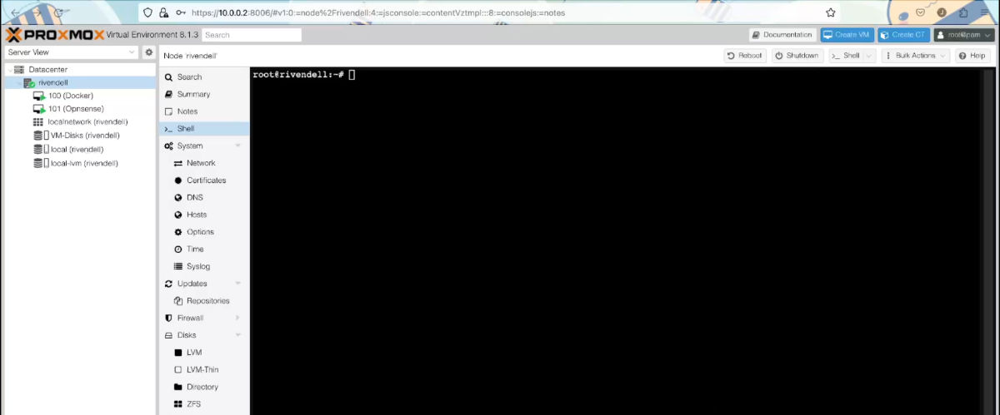
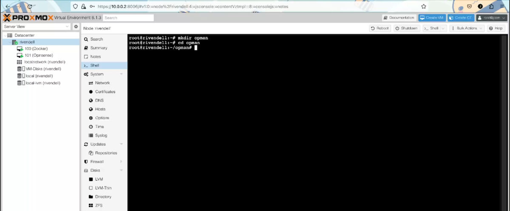
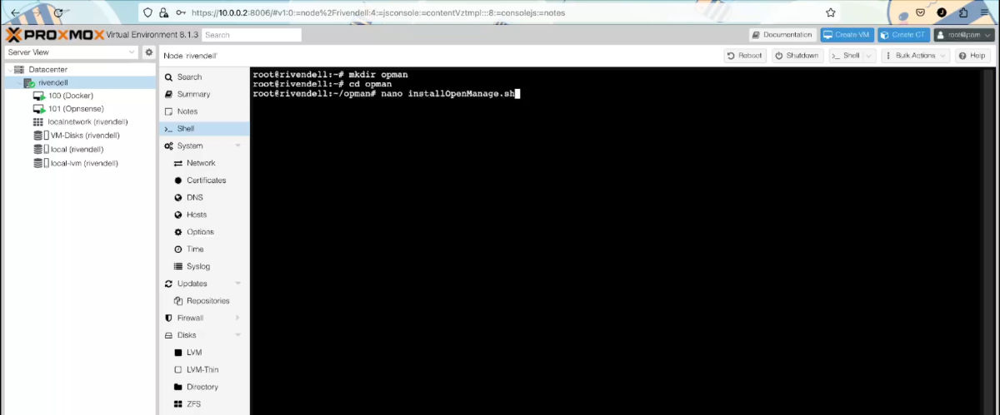
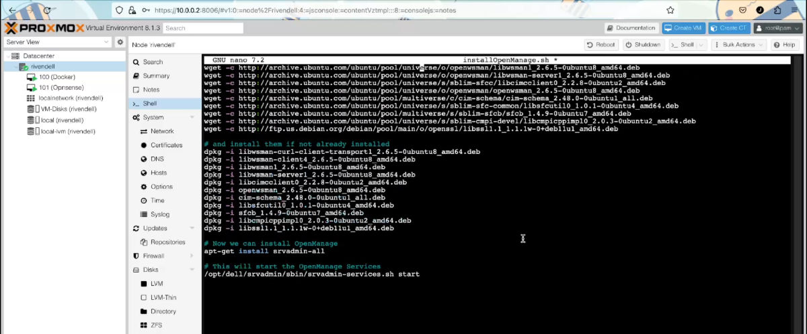
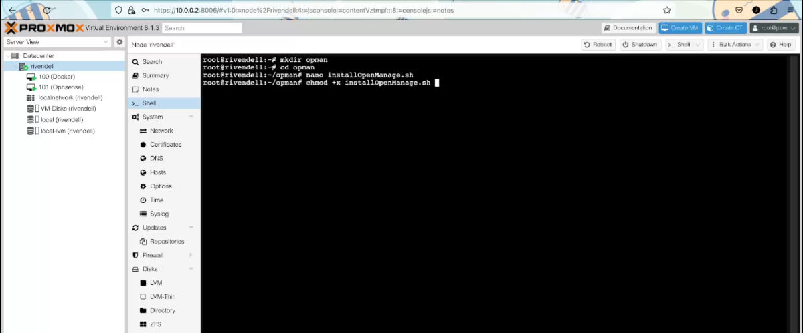
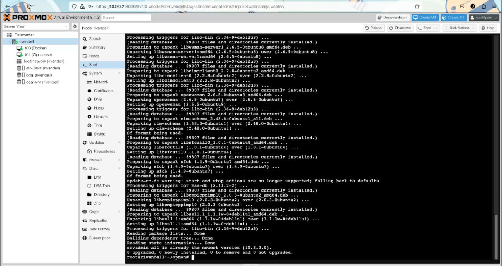
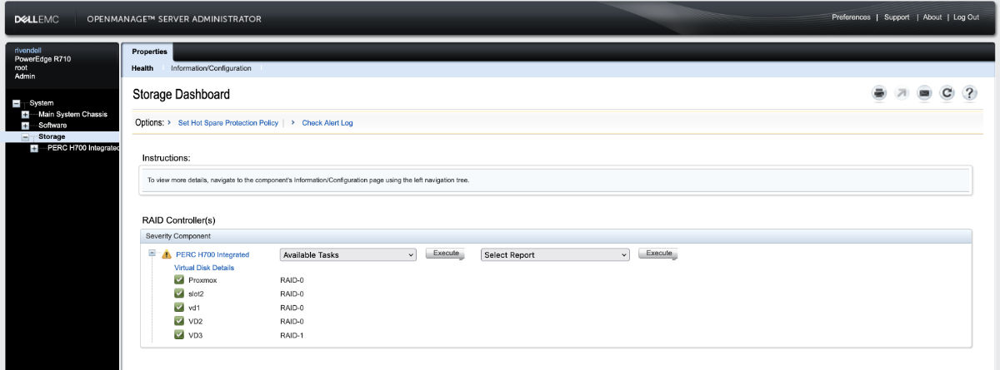

+++
author = "Jonathan Moss"
title = 'How To Install Dell OpenManage Server Administrator on Proxmox 8.1.3'
date = 2024-01-05
description = "How To Install Dell OpenManage Server Administrator on Proxmox 8.1.3"
tags = [
    "Software",
    "Home Lab",
]
categories = [
    "Software",
    "Home Lab",
]
series = ["Home Lab"]
image = "splash.jpg"
draft = false
+++

## What is Dell OpenManage Server Administrator
In short Dell OpenManage Server Administrator (OMSA) is a tool "web browser-based graphical user interface" that allows you to manage your server without having to access the Configuration Utility in the boot screen.

So the server can be running and services don't need to be disrupted to do administration work.

See the following link for more information:

https://www.dell.com/support/kbdoc/en-za/000132087/support-for-dell-emc-openmanage-server-administrator-omsa

## Why Install it
I wanted the ability to control the PERC H700 RAID controller without having to restart the server in order to access the "RAID configuration Utility" in the boot screen.

So adding and removing Hard Drives can be quick and easy to do.

## Installation

In order for the Dell OpenManage Server Administrator to see and have access to the H700 RAID controller. It has to be installed directly on the host OS itself.
You can install it in a "Privileged" container if you would like to. But it will not be able to access the RAID controller. 

I will once again use the "Shell" directly in the Proxmox web UI again. You can do this via ssh if you like.



1. Create a folder to store packages for installation
``` bash
mkdir opman
cd opman
```


2. Create a file called ```installOpenManage.sh```
``` bash
nano installOpenManage.sh
```



3. Paste in the following
```bash
apt update
# This is up to you if you would like to apply all updates
apt upgrade
# These are the extra dependencies I needed
# You can see if you are successful without them
apt install gnupg libcurl4 libncurses5 libxslt1-dev libgpm2 libtinfo5

# Downloads the signature Key from Dell and adds the key to the source file
mkdir -p /etc/apt/keyrings
keyring=/etc/apt/keyrings/linux.dell.com.gpg
wget -qO - https://linux.dell.com/repo/pgp_pubkeys/0x1285491434D8786F.asc | gpg --dearmor -o $keyring
chmod +r $keyring
echo "deb [signed-by=$keyring] http://linux.dell.com/repo/community/openmanage/10300/focal focal main" > /etc/apt/sources.list.d/linux.dell.com.list

# Do a repo update to get OpenManage repos
apt update

# This will download all the needed packages
wget -c http://archive.ubuntu.com/ubuntu/pool/universe/o/openwsman/libwsman-curl-client-transport1_2.6.5-0ubuntu8_amd64.deb
wget -c http://archive.ubuntu.com/ubuntu/pool/universe/o/openwsman/libwsman-client4_2.6.5-0ubuntu8_amd64.deb
wget -c http://archive.ubuntu.com/ubuntu/pool/universe/o/openwsman/libwsman1_2.6.5-0ubuntu8_amd64.deb
wget -c http://archive.ubuntu.com/ubuntu/pool/universe/o/openwsman/libwsman-server1_2.6.5-0ubuntu8_amd64.deb
wget -c http://archive.ubuntu.com/ubuntu/pool/universe/s/sblim-sfcc/libcimcclient0_2.2.8-0ubuntu2_amd64.deb
wget -c http://archive.ubuntu.com/ubuntu/pool/universe/o/openwsman/openwsman_2.6.5-0ubuntu8_amd64.deb
wget -c http://archive.ubuntu.com/ubuntu/pool/multiverse/c/cim-schema/cim-schema_2.48.0-0ubuntu1_all.deb
wget -c http://archive.ubuntu.com/ubuntu/pool/universe/s/sblim-sfc-common/libsfcutil0_1.0.1-0ubuntu4_amd64.deb
wget -c http://archive.ubuntu.com/ubuntu/pool/multiverse/s/sblim-sfcb/sfcb_1.4.9-0ubuntu7_amd64.deb
wget -c http://archive.ubuntu.com/ubuntu/pool/universe/s/sblim-cmpi-devel/libcmpicppimpl0_2.0.3-0ubuntu2_amd64.deb
wget -c http://ftp.us.debian.org/debian/pool/main/o/openssl/libssl1.1_1.1.1w-0+deb11u1_amd64.deb

# and install them if not already installed
dpkg -i libwsman-curl-client-transport1_2.6.5-0ubuntu8_amd64.deb
dpkg -i libwsman-client4_2.6.5-0ubuntu8_amd64.deb
dpkg -i libwsman1_2.6.5-0ubuntu8_amd64.deb
dpkg -i libwsman-server1_2.6.5-0ubuntu8_amd64.deb
dpkg -i libcimcclient0_2.2.8-0ubuntu2_amd64.deb
dpkg -i openwsman_2.6.5-0ubuntu8_amd64.deb
dpkg -i cim-schema_2.48.0-0ubuntu1_all.deb
dpkg -i libsfcutil0_1.0.1-0ubuntu4_amd64.deb
dpkg -i sfcb_1.4.9-0ubuntu7_amd64.deb
dpkg -i libcmpicppimpl0_2.0.3-0ubuntu2_amd64.deb
dpkg -i libssl1.1_1.1.1w-0+deb11u1_amd64.deb

# Now we can install OpenManage
apt-get install srvadmin-all

# This will start the OpenManage Services
/opt/dell/srvadmin/sbin/srvadmin-services.sh start
 ```



4. press ```ctrl + x``` to close nano, then press ```Y``` to save your changes.

5. We then need to give the file executable permissions
```bash
chmod +x installOpenManage.sh
```


6. Now we can run the script
```bash
./installOpenManage.sh
```
Please note that you will need to answer some questions in some of the steps. For example when doing an "Upgrade", So keep an eye out for any prompts.



7. If everything was successful, you can delete the folder
```bash
cd ../
rm -r opman
```

Side Note:
I got most of the information from the following blog post on the Proxmox forum:
https://forum.proxmox.com/threads/dell-openmanage-on-proxmox-6-x.57932/

If you need any more information or troubleshooting, You can go over the original post and see if any of the suggestions in there help you.

## Access the Web UI
To access the UI, open up your web browser and navigate to: 
https://your.proxmox.ip:1311

for example, mine is accessible at:
https://10.0.0.2:1311/

Then login using your iDRAC user.

