+++
author = "Jonathan Moss"
title = 'How To Make Your Dell R710 Quiet using Proxmox'
date = 2024-01-05
description = "We will create a cron job that will run a script that will control the fan speed"
tags = [
    "Hardware",
    "Home Lab",
]
categories = [
    "Hardware",
    "Home Lab",
]
series = ["Home Lab"]
image = "splash.jpg"
draft = false
+++



## How will we achieve this?

In Proxmox, we will create a cron job that will run a script to check the current servers ambient temperature and set the fan speeds accordingly.
The script will need to use two main components to achieve this: 
1. ipmitool for Debian (Proxmox) to use use ipmi protocols in the cli.
2. A iDRAC user account that the script will use to access the iDRAC.
3. Dells iDRAC (iDRAC 6 on the Dell R710) to get the servers ambient temperature and to set the fan speeds.

Just as a side note, I have created a "Management" (10.0.0.0/24) network were things such as the iDRAC and other other management related software / devices are connected to. Having a separate and tightly locked down network where all the IT infrastructure is managed is very important.

I will do a write up on my network design in a future post, but for now I wanted to get this post out to help people silence their server and also help save some electricity in the process. 

## Set your iDRAC LAN Settings and main admin user

In order for us to access the iDRAC web portal, we will need to give the iDRAC NIC an IP address and create the main "Admin" user we can use to login and administrate the server.

make sure to have your iDRAC NIC connected to your desired network


1. To get to the iDRAC bios / settings 
Turn on your server and press the "CTRL + E" key on your keyboard when you see the following message: 
```bash 
"Press CTRL + E for Remote Access Setup within 5 sec"
```


2. Make sure the that the ``` iDRAC6 LAN ``` and ```IPMI Over LAN``` options are set to ```on```

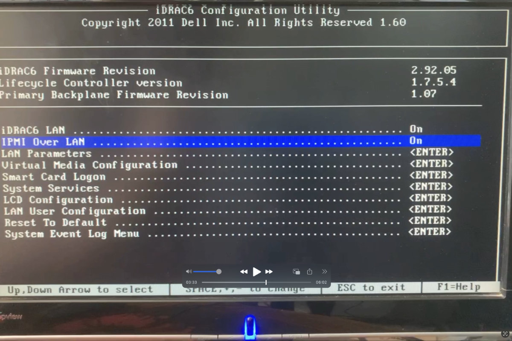

3. Next goto the ```LAN Parameters``` section, navigate down until you get to the ```IPv4 Settings``` section and fill in your desired IP details.


4. Lastly, go to the ```LAN User Configuration``` to create the main user you will use to access iDRAC and administrate your server.


5. Make sure to set the ```IPMI LAN Privilege``` to ```Admin```, set the ```Account Access``` to ```Enabled``` and set the user name and password you would like to use.

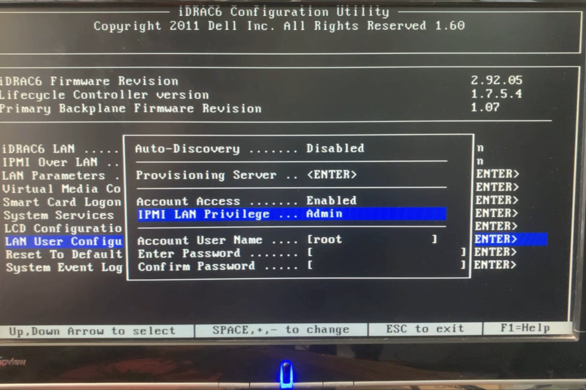

6. press ```ESC``` to exit and save your changes.

## Create a new iDRAC user for our script

We don't want to use our main Administrator account for this as having those details in plain text in a script is very dangerous. 
We will instead create a new user that we will give permissions to use the IPMI.

1. Login to your iDRAC web portal entering your iDRAC IP address in your browser, mine is as follows:
https://10.0.0.4/login.html


2. Login using the user details that you created in the previous section.

2. Once logged in. In the menu on the left side. Open the ```iDRAC Settings``` section

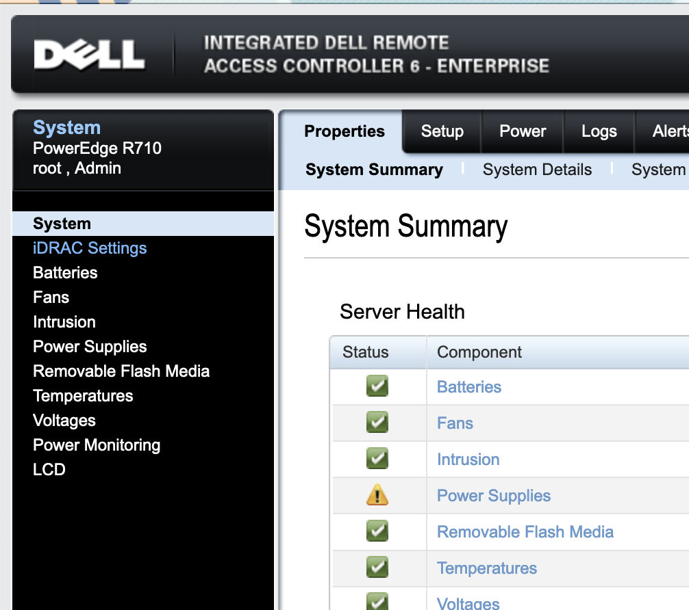

3. Now open the ```Network/Security``` sub menu.

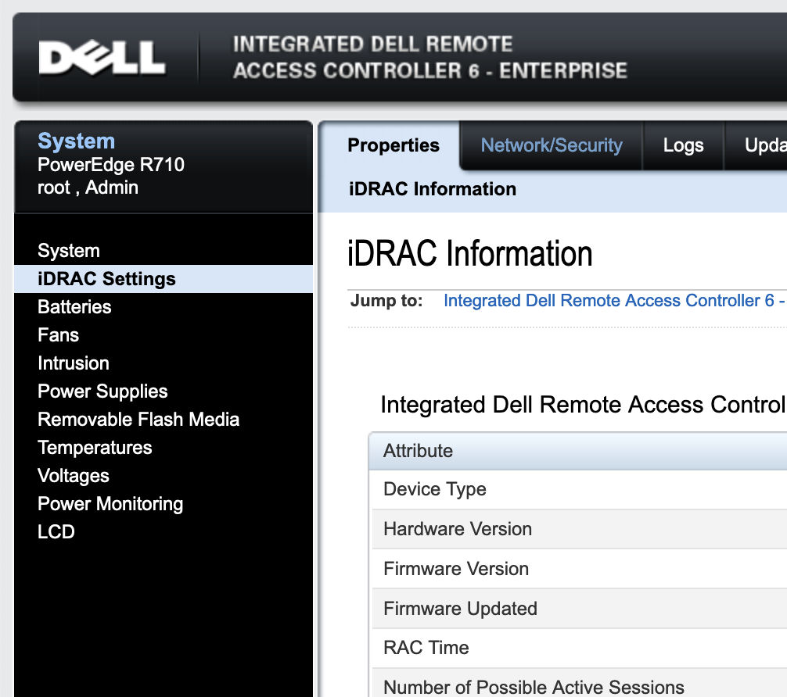

4. Now select the ```users``` section

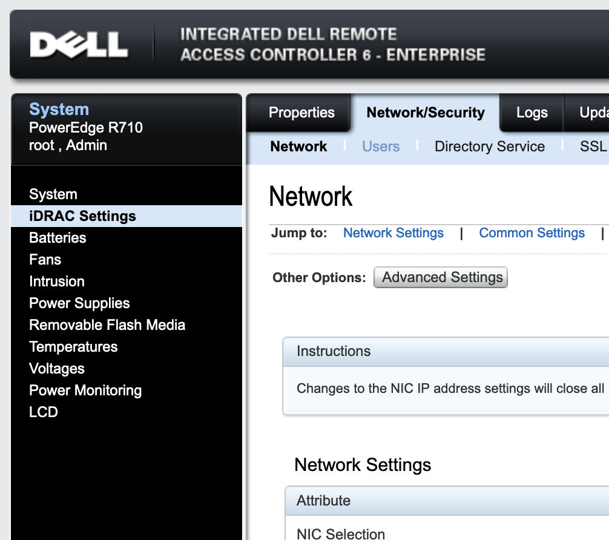

5. click on a free “User ID” number.

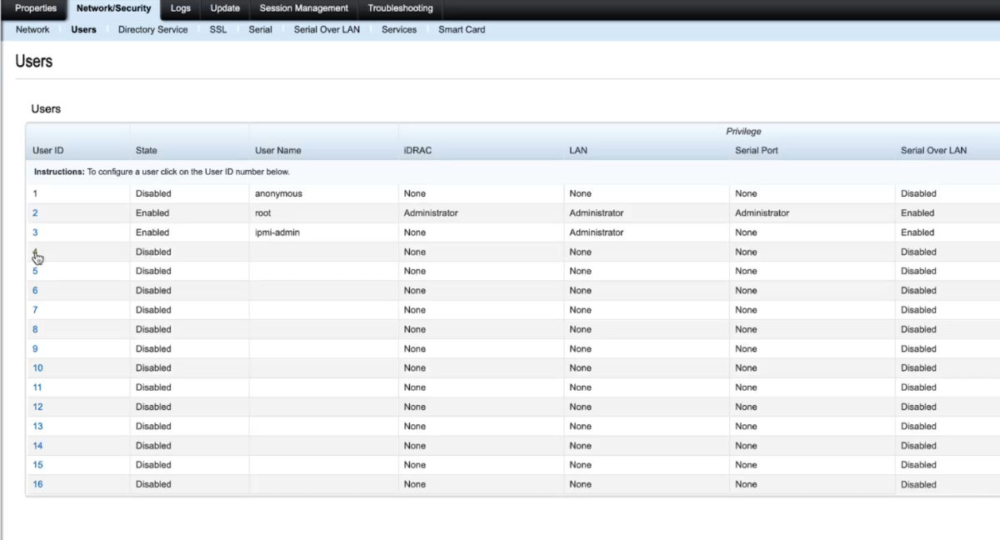

6. Select the “Configure User” radio button, and click “Next”.

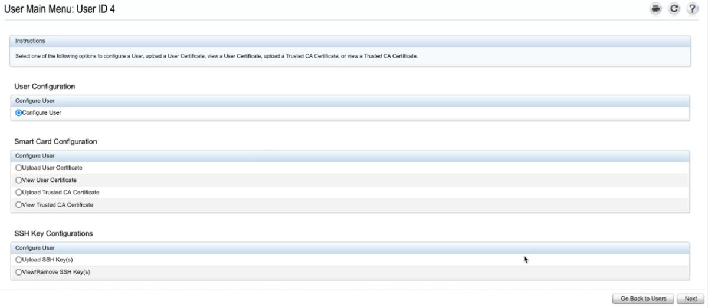

7. Set the following settings:

    The ```Enable User``` check box should be ticked.
    Enter a username.
    Enter a password. A max of twenty alpha-numeric password is needed.
    Set ```Maximum LAN User Privilege Granted``` to ```Administrator```.
    The ```Enable Serial Over LAN``` check box should be ticked.
    Everything else should be default, which will effectively be no permissions.


8. Scroll to the bottom of the page and click “Apply” to create the new user.

## IPMI Encryption

Under the ```Network``` section of the ```iDRAC Settings```. You are able to set a 40 character hex value that will be used for encrypting your connections. For this guide I will leave it all as "0".

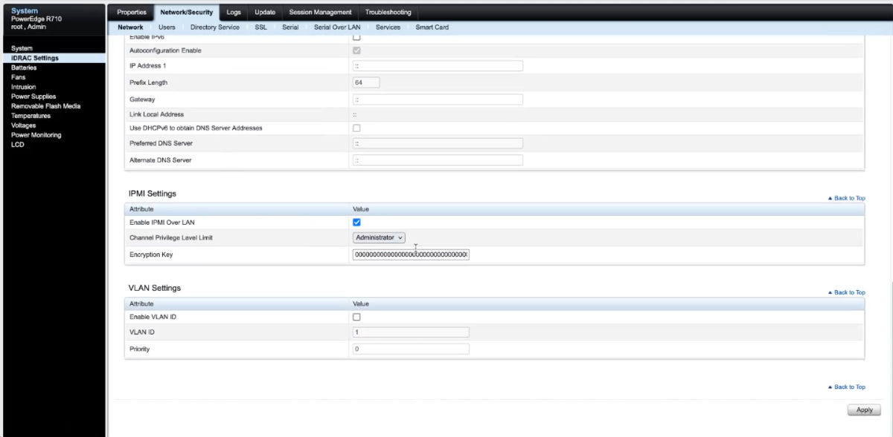

## Install IPMI Tools on Proxmox

I will now login to my host operating system (Proxmox) in my case. I will login to the Proxmox web interface and use the built in shell / terminal. You can use SSH if you prefer that.

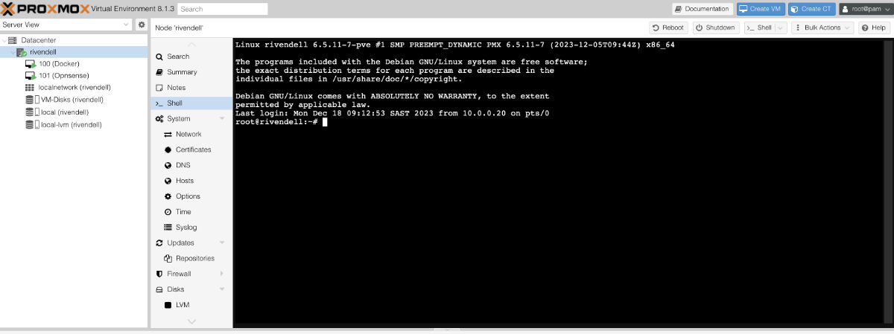

1. Do a repository update and then install ipmitools using the following:

    ``` bash
    sudo apt update && sudo apt install ipmitool
    ```

    if you are already a root user you can just run the following command:

    ``` bash
    apt update && apt install ipmitool
    ```

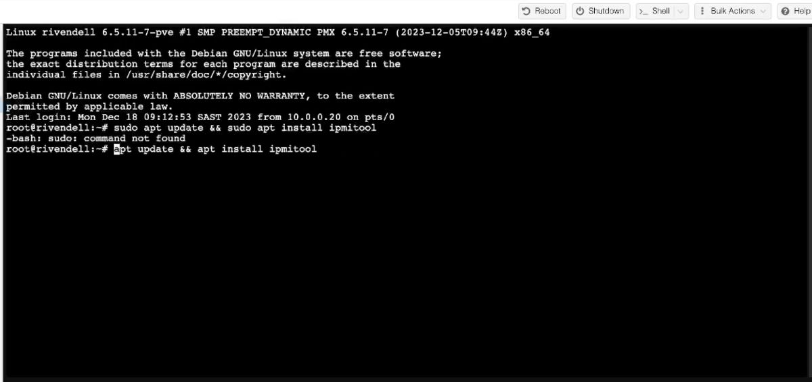

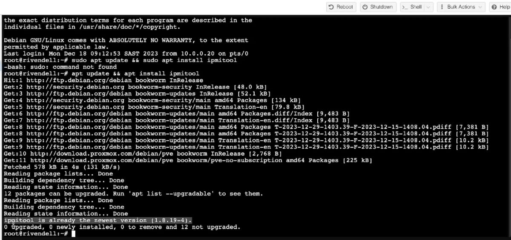

2. We can test if it is working by running the following command:
```bash
ipmitool -I lanplus -H <ip> -U <user> -P <pass> -y <enc> sdr type temperature
```

Make sure to replace the following with your details:
<ip> = your iDRAC IP
<user> = the user you created in the previous section
<pass> = the users password
<enc> = your encryption string

So in my case it will be as follows:

```bash
ipmitool -I lanplus -H 10.0.0.4 -U fan-admin -P asd123asd -y 0000000000000000000000000000000000000000 sdr type temperature
```

If everything is correct, you will get a table with some temperature values.


## The script

1. I will create a new folder in the ```root``` users home folder where I will store the script.
    ```bash
    mkdir fancontrol
    ```

2. I will then use ```nano``` to create a file called ```setspeed.sh```
    ```bash
    nano setspeed.sh
    ```

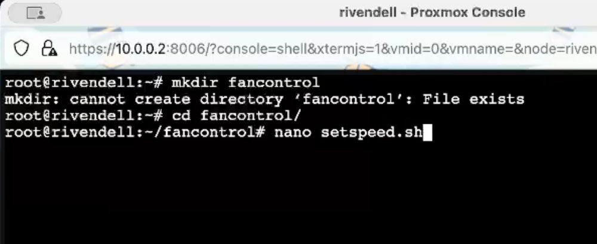

The below script is a modified version of the script found here https://github.com/NoLooseEnds/Scripts/tree/master/R710-IPMI-TEMP

The original script was split into two files which I found was unnecessary and got confusing to edit. So I merged them into one file to be easier to maintain. 
I also added a ```FANSPEED``` variable to make it easier to set the fan speed by utilisation percentage as the original script did not have that function.

3. Copy and paste the below script into nano 

```bash
#!/bin/bash

# IPMI IP address
IPMIHOST=10.0.0.4
# IPMI Username
IPMIUSER=fan-admin
# IPMI Password
IPMIPW=y0urPassw0rd
# Your IPMI Encryption Key
IPMIEK=0000000000000000000000000000000000000000
# Fan Speed / utilisation in percentage, for example 9 for 9% utilisation
# Please note that each fan can have a different rpm and will not all be the same speed
FANSPEED=9

# TEMPERATURE
# Change this to the temperature in Celsius you are comfortable with.
# If the temperature goes above the set degrees it will send raw IPMI command to enable dynamic fan control
MAXTEMP=27

# This variable sends a IPMI command to get the temperature, and outputs it as two digits.
# Do not edit unless you know what you do.
# Side note, if you are running ipmitool on the system you are controlling, you don't need to specify -H,-U,-P - from the OS installed on the host, ipmitool is assumed permitted. You only need host/user/pass for remote access. 
TEMP=$(ipmitool -I lanplus -H $IPMIHOST -U $IPMIUSER -P $IPMIPW -y $IPMIEK sdr type temperature |grep Ambient |grep degrees |grep -Po '\d{2}' | tail -1)

# Dont edit this, this converts decimal to hex
SPEEDHEX=$( printf "%x" $FANSPEED )

if [[ $TEMP > $MAXTEMP ]];
  then
    printf "Warning: Temperature is too high! Activating dynamic fan control! ($TEMP C)" | systemd-cat -t R710-IPMI-TEMP
    echo "Warning: Temperature is too high! Activating dynamic fan control! ($TEMP C)"
    # This sets the fans to auto mode, so the motherboard will set it to a speed that it will need do cool the server down
    ipmitool -I lanplus -H $IPMIHOST -U $IPMIUSER -P $IPMIPW -y $IPMIEK raw 0x30 0x30 0x01 0x01
  else
    printf "Temperature is OK ($TEMP C)" | systemd-cat -t R710-IPMI-TEMP
    printf "Activating manual fan speeds! (1560 RPM)"
    # This sets the fans to manual mode
    ipmitool -I lanplus -H $IPMIHOST -U $IPMIUSER -P $IPMIPW -y $IPMIEK raw 0x30 0x30 0x01 0x00
    # This is where we set the slower, quiet speed
    ipmitool -I lanplus -H $IPMIHOST -U $IPMIUSER -P $IPMIPW -y $IPMIEK raw 0x30 0x30 0x02 0xff 0x$SPEEDHEX
fi
```

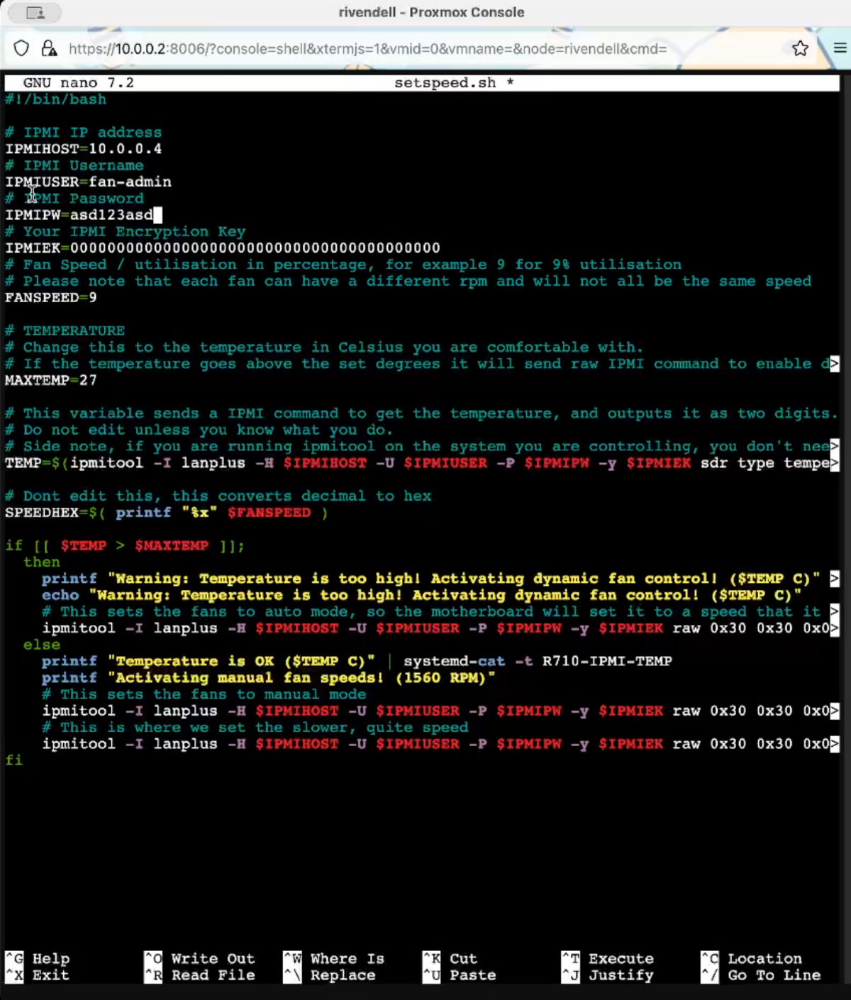

4.  press ```ctrl + x``` to close nano, then press ```Y``` to save your changes.

5. We then need to give the file executable permissions
```bash
chmod +x setspeed.sh
```

6. You can test your script to make sure it is working, set a speed in the script and run it.
```bash
./setspeed.sh
```

In your iDRAC web portal, under the ```fans``` section, you can see the current rpm of each fan.

So at 9 percent speed my fans run at around 2040 rpm.

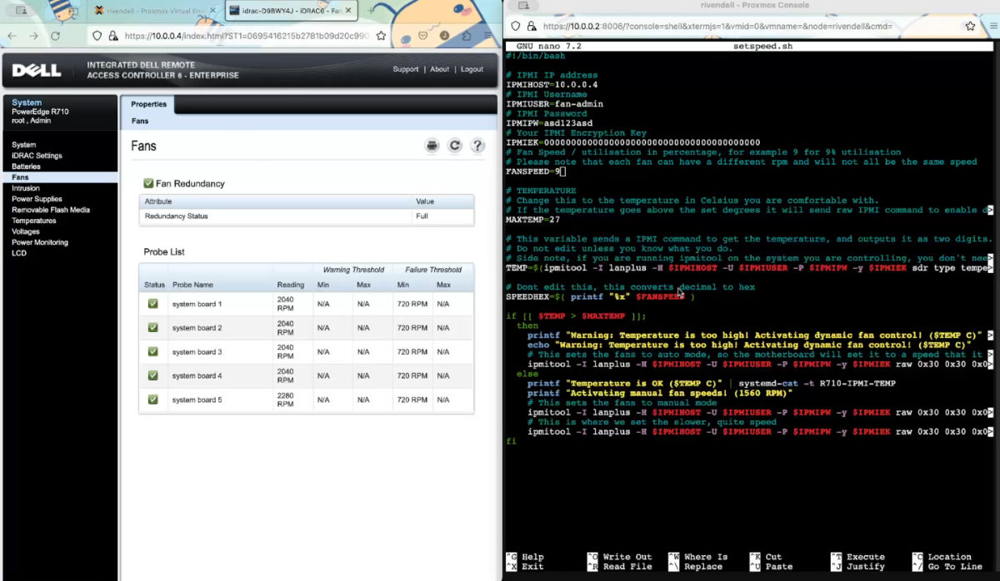

And at 50 percent speed my fans run at around 7320 rpm.


## Create a cron job

Next we need to create a cron job that Proxmox will run on startup and every minute (in this case) you can change how often the job runs. That is up to you.

1. Open crontab
```bash
crontab -e
```


2. Add the following line to the end of the file
```js
*/1 * * * * /bin/bash /root/fancontrol/setspeed.sh > /dev/null 2>&1
```

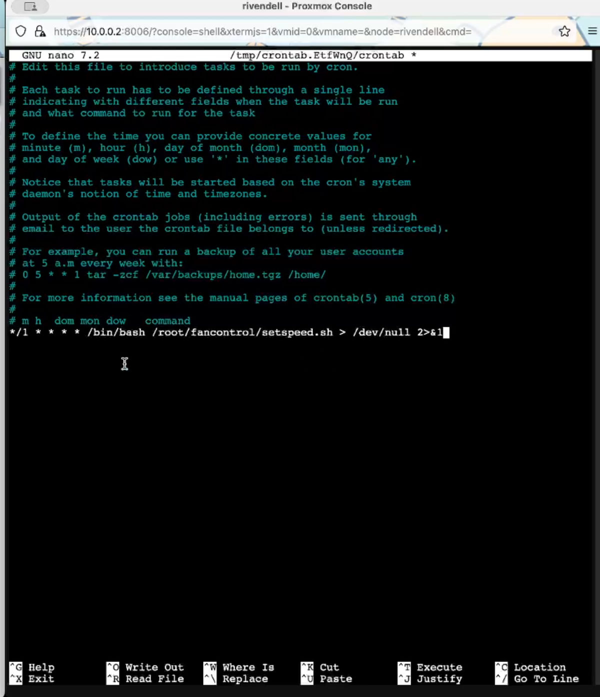

3. You can then exit and save the file. Then in Proxmox, if we look at the syslog, we will see that in a minutes time, the cron job will execute.


## Conclusion

You will now have a script that will run every minute, check on the servers ambient temperature and then set the fan speeds accordingly.