+++
author = "Jonathan Moss"
title = 'How to add a new hard drive to an existing RAID 0 Virtual Disk on a H700 RAID Controller'
date = 2024-02-16
description = "This is a guide will show you how to add a hard drive to a RAID 0 VD on a H700 RAID Controller."
tags = [
    "Hardware",
    "Home Lab",
]
categories = [
    "Software",
    "Home Lab",
]
series = ["Home Lab"]
image = "splash.jpg"
draft = false
+++

## Introduction

This is just a quick guide on how to add another drive to an existing RAID 0 virtual disk on th H700 RAID Controller.

### A use case scenario:

I have a 500GB HDD that I use as a "Directory" disk in Proxmox to store "ISO images" and "Virtual Machine HDDs".

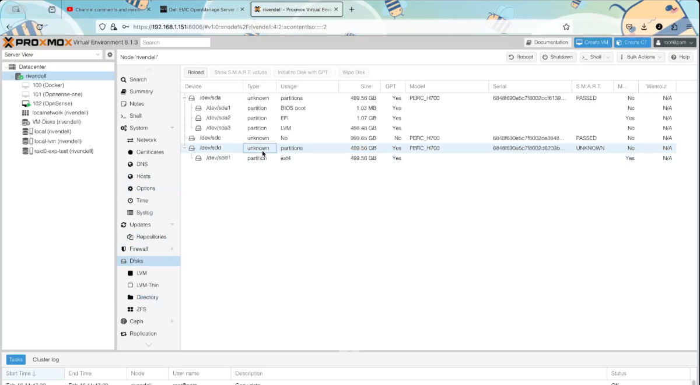

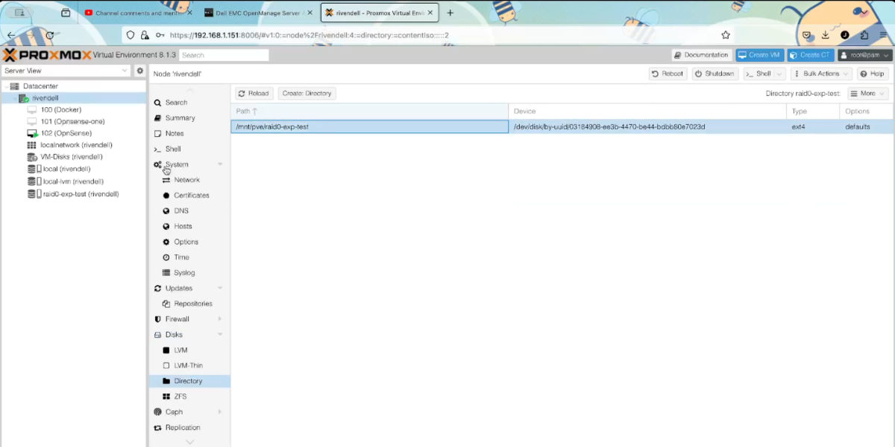

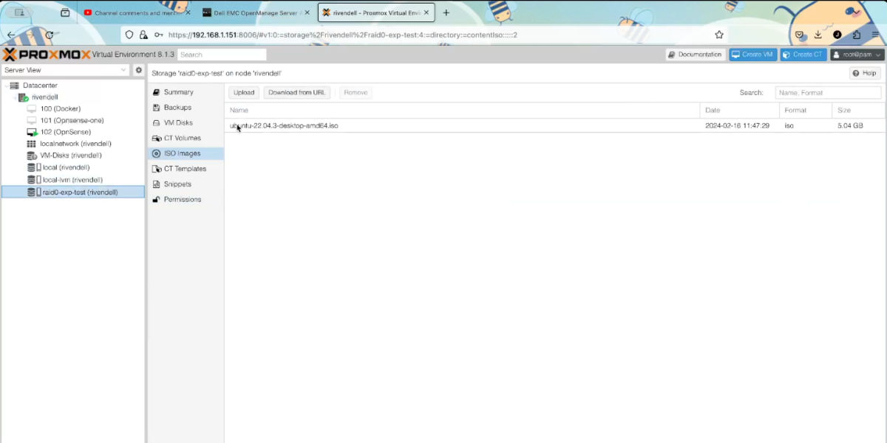

This drive is a RAID 0 virtual disk created on a H700 RAID Controller.

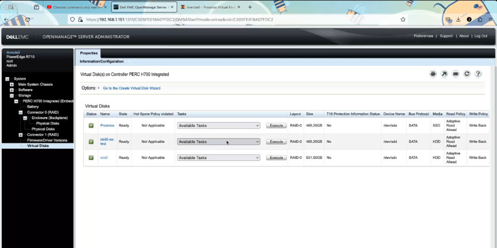

I would like to add another 500GB hard drive to it to increase the size of it.
Below is the process on how to do it using the Dell OpenManage Server Administrator.

## How to add a hard drive to a RAID 0 virtual disk on a H700 Controller

**Make sure to back up your files first, You never know if something will go wrong, So always make sure you have a working backup**

1. Login to the OpenManage Server Administrator Web UI

You can see how I installed it on proxmox in the following post:
https://jono-moss.github.io/post/dell-openanage-server-administrator-12-01-2024/

or you can download and run the Live CD from Dells website:
https://www.dell.com/support/home/en-us/Drivers/DriversDetails?driverId=C31J4

2. Once Logged in. Goto the the "Virtual disks" under the "PERC H700 Integrated" menu.
storage -> PERC H700 Integrated -> Virtual disks

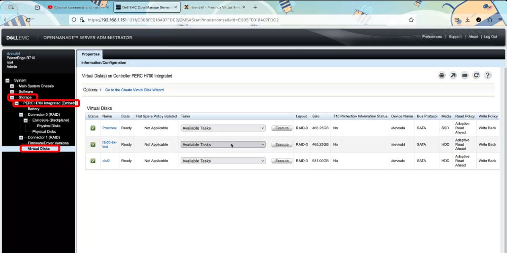

3. In the "Drop Down" list next to the existing RAID 0 Virtual disk that you want to expand. Choose the "Reconfigure" option. Then click on the "Execute" button.

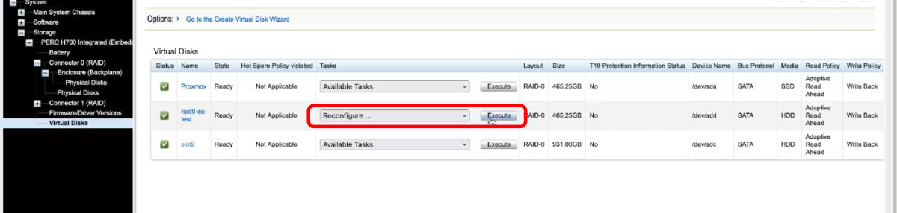

4. Select the hard drives you would like to add to the RAID 0 Virtual Disk.

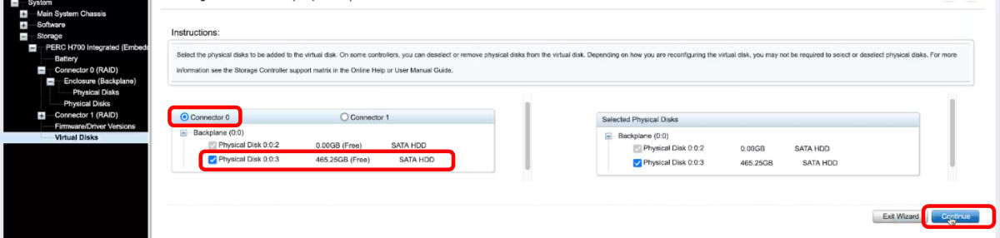

5. Click on the "Continue" button.

6. You will be presented with a screen where you can change the RAID type, leave it as RAID 0. Click on the "Continue" button.

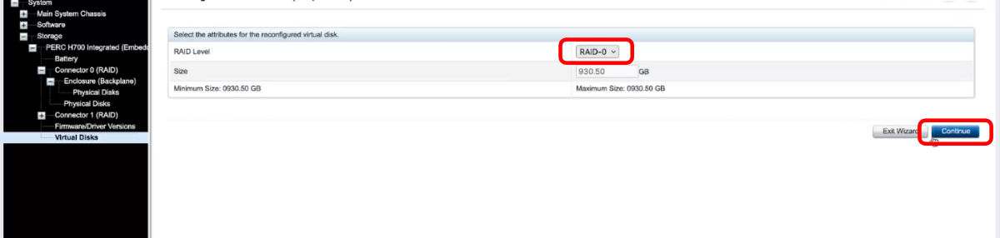

7. If a warning message opens due to the total disk size being large. Click the "Continue" button again and accept the "Information" message that will pop up 

8. You will be presented with a screen showing you what the results will be and what the total Virtual Disk size will be once it is completed. Click on the "Finish" button to start the "Reconfiguration" process.

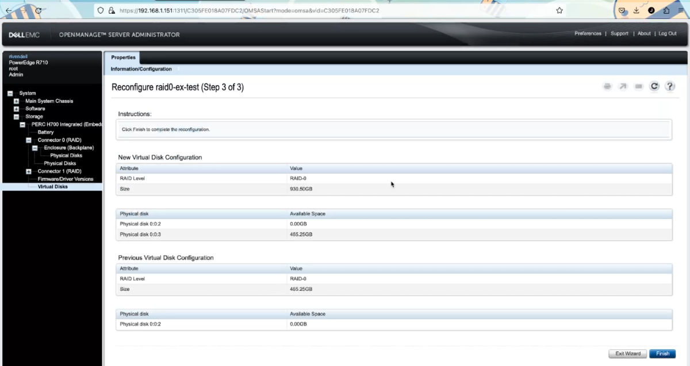

9. Depending on the speed of your hard drives and the total size of them, the "Reconstructing" process can take hours to days to complete.

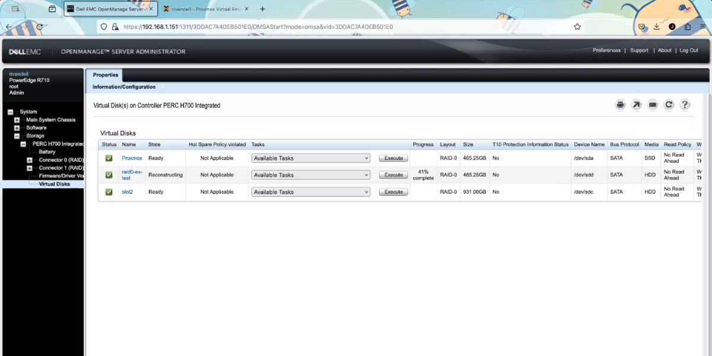

For example for me adding a 500GB (12 year old HDD) to the Virtual Disk took just under 9 hours.

10. Once it has completed, you will see the new size of the disk.

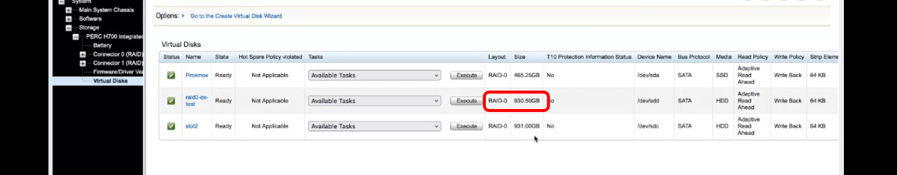

11. Now all that was left is to restart the server so that Proxmox / Debian can see the hard drive size change. Please note, when rebooting the server, the os changed the drive to "/dev/sdb", which now has "999.12GB" space. But the partition is still only using "499.56GB". I will now need to resize the partition (If I want) or I can create a new partition with the free space.

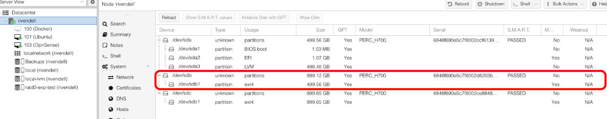

## About the process

The process is "additive", so it is a non interrupting and non destructive process. You can continue to use the virtual disk while the "Reconstructing" is in progress.
So for example I made an "Ubuntu Virtual Machine" saved and running on the RAID 0 virtual disk while it was still in progress.

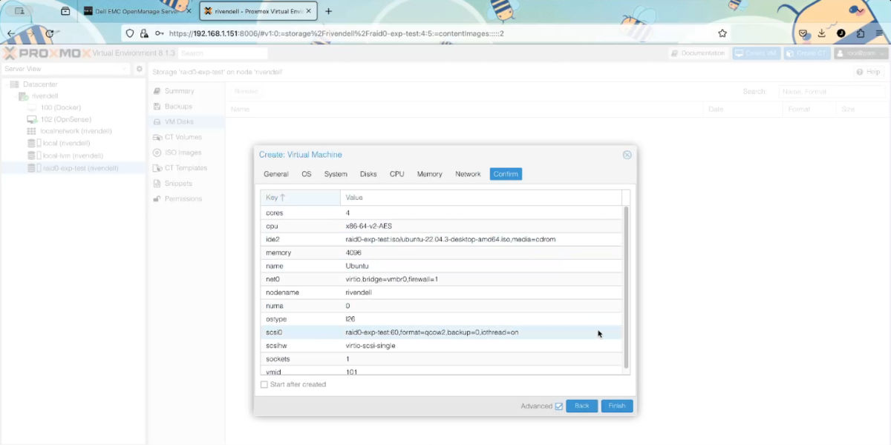

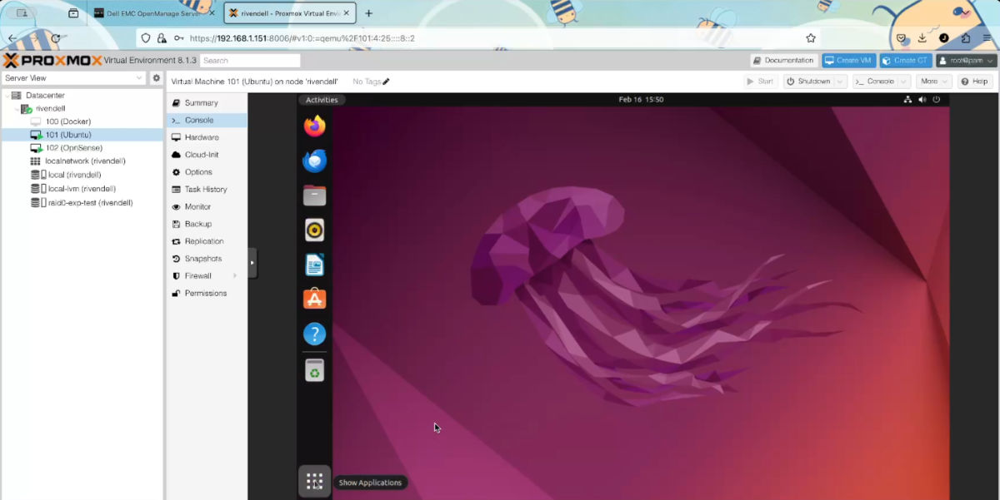

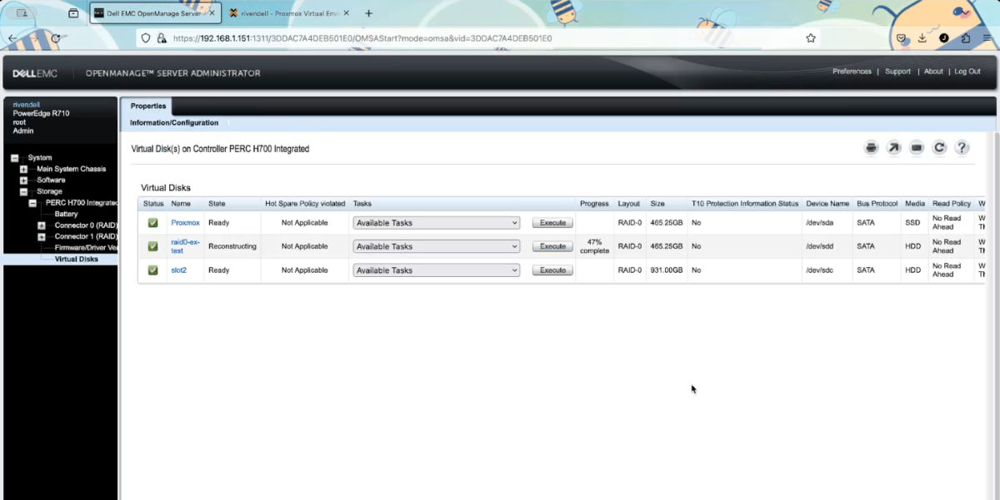
