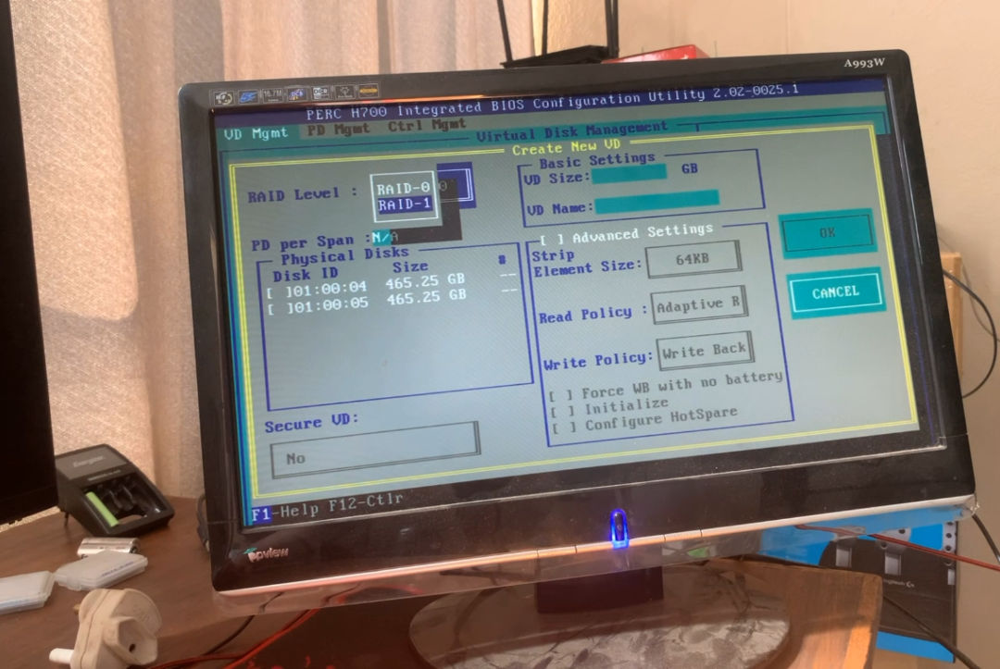

+++
author = "Jonathan Moss"
title = 'How To Add Drives To The Dell PERC H700 RAID Controller'
date = 2023-12-26
description = "This is how to add drives to the Dell PERC H700 RAID controller"
tags = [
    "Hardware",
    "Home Lab",
]
categories = [
    "Hardware",
    "Home Lab",
]
series = ["Home Lab"]
image = "splash.jpg"
draft = false
+++

## PERC H700 RAID controller

The Dell R710 that I recently purchased came with a PERC H700 RAID controller. In this guide I want to go over how to access the controllers BIOS Configuration Utility to add HDDs / SSD's to it.

## Add your hard drives to the server

I had four extremely  old Seagate 500 GB Barracuda Sata hard drives laying around, I will only be using those to demonstrate how to add drives to the server.


## How to access the controllers bios

To access the controllers BIOS Configuration Utility. 
Turn on your Dell R710 and wait until you see the message to press the:
``` Ctrl + R ``` Keys

Press the ``` Ctrl + R ``` Keys to open the Utility.


## RAID type to use

I would recommend that you read the user guide provided by Dell.
From page 17 they go over the different RAID types and terminology. 
For this guide I'm going to use two drives individually, so RAID 0 and then the last two drives I will create a RAID 1 group.

https://dl.dell.com/manuals/all-products/esuprt_ser_stor_net/esuprt_dell_adapters/poweredge-rc-h700_user's%20guide_en-us.pdf

For a quick references, below is a paragraph from the above manual about the different RAID types:

```
RAID Description
RAID is a group of independent physical disks that provides high performance
by increasing the number of disks used for saving and accessing data.

A RAID disk subsystem offers the following benefits:
• Improves I/O performance and data availability.
• Improves data throughput because several disks are accessed
simultaneously. The physical disk group appears either as a single storage
unit or multiple logical units to the host system.
• Improves data storage availability and fault tolerance. Data loss caused by
a physical disk failure can be recovered by rebuilding missing data from the
remaining physical disks containing data or parity.
CAUTION: In the event of a physical disk failure, a RAID 0 virtual disk fails,
resulting in data loss.

Summary of RAID Levels
• RAID 0 uses disk striping to provide high data throughput, especially for
large files in an environment that requires no data redundancy.
• RAID 1 uses disk mirroring so that data written to one physical disk is
simultaneously written to another physical disk. RAID 1 is good for small
databases or other applications that require small capacity and complete
data redundancy.
• RAID 5 uses disk striping and parity data across all physical disks
(distributed parity) to provide high data throughput and data redundancy,
especially for small random access.
• RAID 6 is an extension of RAID 5 and uses an additional parity block.
RAID 6 uses block-level striping with two parity blocks distributed across
all member disks. RAID 6 provides protection against double disk failures,
and failures while a single disk is rebuilding. If you are using only one array,
deploying RAID 6 is more effective than deploying a hot spare disk.
• RAID 10 is a combination of RAID 0 and RAID 1, uses disk striping
across mirrored disks. It provides high data throughput and complete data
redundancy. RAID 10 can support up to eight spans, and up to 32 physical
disks per span.
• RAID 50 is a combination of RAID 0 and RAID 5 where a RAID 0 array
is striped across RAID 5 elements. RAID 50 requires at least six disks.
• RAID 60 is a combination of RAID 0 and RAID 6 where a RAID 0 array is
striped across RAID 6 elements. RAID 60 requires at least eight disks
```

## How to add HDDs

Once the Configuration Utility is open, you will see a list of all your new HDDs at the bottom of the list under the "Unconfigured Physical Disks" section. So for exammple we can see that all four of our 500GB HDDs are showing up. If we only saw three for example, we could take a look at the caddy's LED lights and find the one where the LED is not on. From there we could double check that the HDD is inserted correctly or troubleshoot further. 


1. Use the ``` UP or DOWN ``` arrows on your keyboard to highlight the Top most item "PERC H700 Integrated (Bus 0x03, Dev 0x00)" in the list.


2. Press the ``` F2 ``` key to open the "Operations" menu.


3. Highlight the "Create New VD" (VD stands for Virtual Disk) and press the ``` Enter / Return ``` keyboard button to open the "Virtual Disk Management" Menu.


Please note that you can use the ``` UP or DOWN ``` arrows on your keyboard to navigate the menu.

### RAID type

4. Highlight the "RAID Level" input. When you have it highlighted, press the ``` Enter / Return ``` keyboard button to select the RAID Level you would like. 
In this case, I want to create a single RAID 0 drive. So I will only select the "RAID-0" option. Please note that You will only be presented with the available options depending on the amount of free drives you have. 

    In the screenshot below, I only have two HDDs available, so the max RAID Level I can create is RAID-1. 
    

5. Use the ``` DOWN ``` arrow on your keyboard to highlight the HDD you would like to add the the "Disk Group". When you have the HDD highlighted, press the ``` Space ``` keyboard button to select the HDD to be part of the "Disk Group". 
I this case, I want to create a single RAID 0 drive. So I will only select the first disk.


    If for example you would like to create a RAID 1 disk group. Select two HDDs you would like to use.
    

6. Using the ``` DOWN ``` arrow on your keyboard continue to press ``` DOWN ``` until you are on the "VM Name" input and type in the name you would like to call your Disk Group.


7. Using the ``` DOWN ``` arrow on your keyboard continue to press ``` DOWN ``` until you are on the "OK" button and then press the ```Enter / Return``` button to finalise your creation.


## How to initialise the new disk groups.

1. Highlight the HDDs in your new Disk Group and press the ``` F2 ``` button to open the " Operations Menu " again.


2. Press ``` Enter / Return ``` on the "Initialization" option, then press ``` Enter / Return ``` on the "init. Start" option. This will start initializing the drives to be used in your OS.


3. Press ``` Enter / Return ``` to accept that any data on the disks will be deleted.


4. Continue to do that for all your new Virtual Disks.

## Conclusion

Hopefully this quick guide helps you on your path of adding new drives to your PERC H700 RAID Controller. I recommend that you read and study the different RAID Levels / Types in order to know which type will be the best for your use cases. 