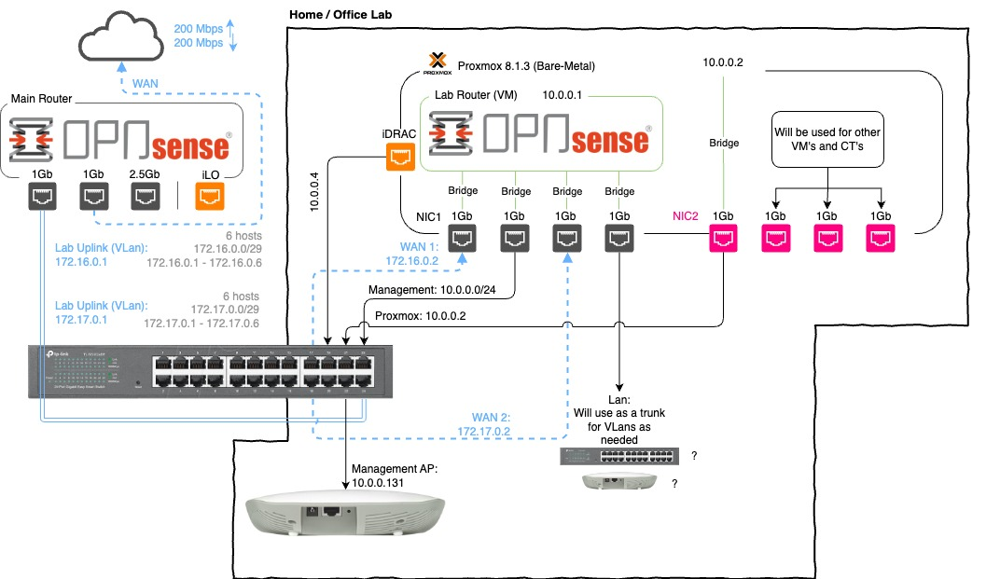

+++
author = "Jonathan Moss"
title = 'Home Lab Network Design'
date = 2024-01-26
description = "I want to do an OpenSense tutorial series, this is the network we will setup and use."
tags = [
    "Hardware",
    "Home Lab",
    "Networking",
]
categories = [
    "Hardware",
    "Home Lab",
    "Networking",
]
series = ["OpenSense"]
image = "splash.jpg"
draft = false
+++

## Home Lab Network Design
I wanted to share the design of the network I will be creating and using in my new home / office lab setup. I will briefly go over the requirements of what in my opinion every lab network should have and how I will achieve this with as little hardware as possible.

## The requirements
1. Dual WAN ports. It is very important to learn how to use and work in a multi WAN environment. Most medium to large companies will have to use a Multi WAN network, so learning how to work with them in your Lab is important.

2. It is important to have all your "Management" software and devices on its own network. This helps with security as well as keeps the network more manageable when separating specific devices to specific networks.

3. The last requirement will then be to have a "LAN Port" that we can use for what ever we need to as this series continues. For example we will most probably use this port as a "Trunk" for VLANs. We will most probably use it to create VLANs such as "IOT/Mobile, Office and Guests" which we can then connect to another Managed switch to grow the network over time. 

## The Design

*Please note that this will change as the network grows or as needed.*

### Managed Switch
The heart of my network is the "TP-Link TL-SG1024DE" managed switch. I have been using it for years and it has been an incredible switch for me. I use VLANs (802.1Q) to be able to split the switch up into the different networks.

I use it in the following way:
- The first 8 ports (1-8) are used from my "Home Network".
- The next 8 ports (9-16) are used for my "Business Network".
- The next 7  (17-23) are used for my "Lab Network".
- the last port (24) is used as a trunk for my "Home, Business and home Lab".  

this allows me to only need one switch for my entire network, which saves space and electricity.

### WAN connections for the Lab
I have created a trunk from my "main router" that will have two VLANs (104 and 105). 

On my main router, I created two VLAN networks that I will then use as WAN connections for our lab.

- VLAN 104, 172.16.0.0/29
- VLAN 105, 172.17.0.0/29

This goes into port 24 as a "tagged" VLAN, then on port 17 and 18 they will be "untagged". That is then connected to OpnSense as gateways.

We will then have two WAN networks to play with in the Lab.

### OpnSense
I will be installing OpnSense on a Virtual Machine and give the Virtual Machine access to the NIC ports via "Linux bridges". 

This way it allows for easier and quick adding and removing ports as needed. It will also help with migration and clusters if you would like to do that. Passing (Passthrough) an entire NIC to the virtual machine is not needed and can actually be more of a pain at times to manage then just using bridges.

### Conclusion
Honestly there is not much more for me to explain as I think the diagram explains a lot already. I will see how it goes, but I will most probably do a Youtube Video showing the installation process and how I went about setting up the networks from beginning to end. 

However since it will be a very time intensive task, I will be looking into splitting it up into a series of smaller videos, but I will see how things go and take it as it comes.
But I'm excited to start on this series and I hope you will enjoy it and learn a lot. 