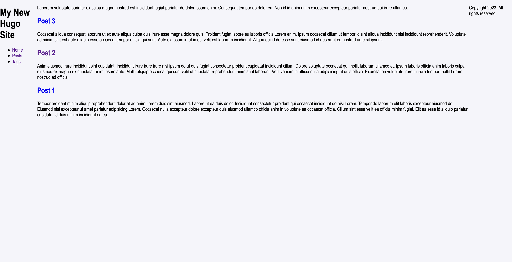
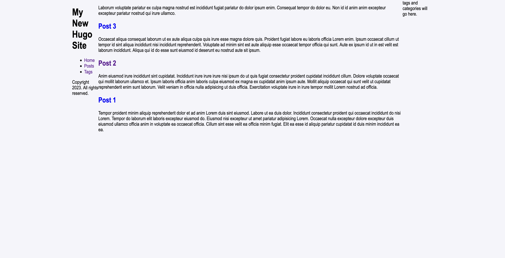
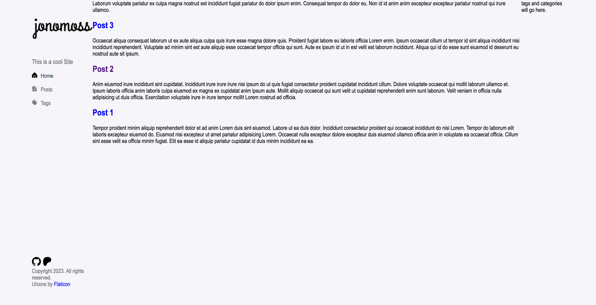
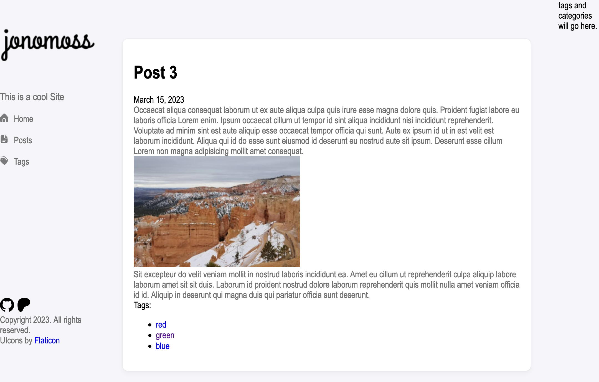
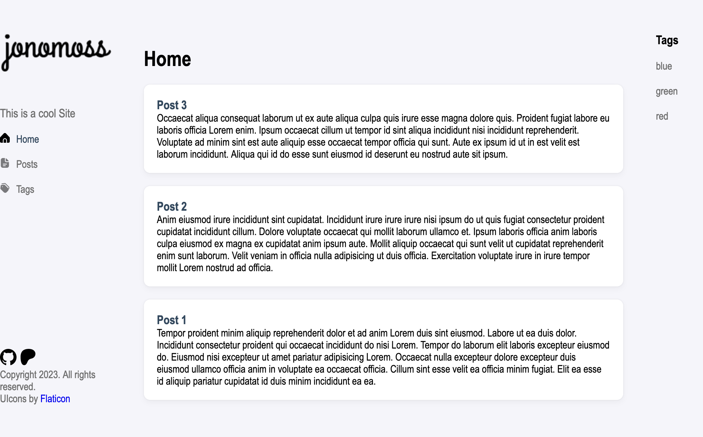

+++
author = "Jonathan Moss"
title = 'Learning Hugo - Layouts'
date = 2023-12-04
description = "Learning Hugo Theme Layout Structure"
tags = [
    "Hugo",
    "Development",
]
categories = [
    "Development",
]
series = ["Learning Hugo"]
image = "splash.jpg"
draft = false
+++

## Learning Hugo
I wanted to learn how to use the Hugo framework.
The purpose of this guide, is to document my thought process and have a step by step guide to help me with future Hugo theme creations. If you have ever had to maintain a "dynamic" web application that is accessible by the public. You will know what security nightmare it becomes and the amount of time it takes to maintain it. Frameworks such as Wordpress has haunted me for years as it is like a flame that attracts endless moths of malicious actors having a field day constantly probing and prodding your the site and server. I have always preferred to have "Static" based websites, and seeing the power of frameworks such as Hugo and Jekyll. It is about time I jump in and learn how to use them. 

I usually just develop my sites from scratch, but being able to have a "blog" like function where I can keep my focus on creating articles and content in general and have Hugo generate the pages for me, saving me time and having almost no stress in worrying plugin security all the time. 

## Purpose of this guide.
I will only be going thought learning how the layouts and basic content of a Hugo theme works. This guide will not be an ```html``` tutorial. I just wanted to see how to quickly get a basic theme started and will not be worrying about how the final design will look or even add and "responsive" development yet. I want to first understand the structure of a theme and how Hugo deals with the "content" of the site.

I will go into more depth in future guides and eventually end up using the theme I make as my main theme for this website. However  for now I will be using the beautiful - Stack https://github.com/CaiJimmy/hugo-theme-stack theme for this site but will move to my own theme once I am comfortable with my own theme.

## Installation and Initialisation
1. Install Hugo
    https://gohugo.io/getting-started/quick-start/

2. Create a folder on where you would like to create your project.

3. Using your favourite terminal ```cd``` into that folder.

4. Initialise a new site with the following command
    ```bash
    hugo new site hugo
    cd hugo
    git init
    ```

5. We will now create a blank theme to start with:
    ```bash 
    hugo new theme themeName 
    ```
    change ```themeName``` to what you would like to call your theme.
    In my case it will be called ```jonomoss```

6. Open the project with your favourite IDE:

7. We now need to tell Hugo to use this theme to render the pages:
    1. edit the top most ```hugo.toml``` file with the following and remove all the other lines:
        ```toml
        theme = "themeName"
        ```  
    2. Your ```hugo.toml``` file will look like this:
        ```toml
        theme = "jonomoss"
        ```

8. run it:
    ```bash 
    hugo server -D
    ```
9. You can now goto http://localhost:1313/ in your favourite browser and you will see a barebones website.

## A Quick Overview of The Theme Structure

1. We will be focusing on the folders in the theme folder from now on.
In my case it is the following folder:
```hugo/themes/jonomoss/```

2. The ```layouts/``` folder contains all the common html files that will be the main layout of all generated pages. Think of this as the main building blocks of your site.

3. The ```layouts/partials/``` have all the modular parts of a website. So for example it has the ```footer, header, menu``` and other components to use in giving your pages structure.

4. The ```layouts/_default/``` are the main "Wrapper / Containers" that will tie the desired components from the  ```layouts/partials/``` eg ```footer, header, menu``` to build the desired full page for the sites content to be displayed on.
For example if we want to display a ```single``` page or the ```home``` page.

5. The ```assets/``` folder is where all the assets needed for the theme will be stored. This is the ```css, js, images``` etc.

6. The ```static/``` folder is where all the public files that will be copied to the public directory eg ```.htaccess, favicon.ico, robots.txt``` will be stored.

This is just a quick overview of the main folders that we will use and work on to create our own theme. For a full explanation of the entire folder and file structure, see https://gohugo.io/getting-started/directory-structure/

## Design
1. For the purpose of this guide, we will create a very basic three column website.
    1. The Header will be a fixed column on the left
    2. The content will be in the middle.
    3. the last column will have a search bar, tags and categories.
    
I find that to be a good structure for blog style websites

2. I won't go too deep into the html code as this is not a guide on html development, but rather an overview of where to put the pieces of code to create a theme.

## Development
1. We will start by setting some global styles in the stylesheet. Hugo does support ```scss``` but personally I prefer to stick with plain ```css```.
Open the ```main.css``` file in  the ```assets/css``` folder. These are the basic global styles we will use for this example.

``` css
:root {
  --bg-color: #f5f5fa;
  --main-text-colour: #333333;
  --global-font: 'Franklin Gothic Medium', 'Arial Narrow', Arial, sans-serif;
  --content-max-width: 1200px;
}

/* Global Styles and Layout*/

html, body {
  margin: 0;
  padding: 0;
  width: 100%;
  height: 100%;
  font-family: var(--global-font);
}

body {
  background-color: var(--bg-color);
}

#container {
  display: flex;
  flex-direction: row;
  margin: auto;
  max-width: var(--content-max-width);
  height: 100%;
}

a {
  text-decoration: none;
}

header {
  width: 260px;
  display: flex;
  flex-direction: column;
  margin: 0 20px;
}

aside {
  width: 300px;
}

footer {
  width: 100%;
}
```

You will end up with a basic three column site.


2. We will now wrap the site in the ```#content``` id that we created in the ```css``` file to help limit the size of our content on wide screens.
Open the ```_default/baseof.html``` file and we will wrap all our content in a new ```div``` giving it the ```#content``` id.

3. I would like to also move the ```footer``` into the header and create a new ```aside``` that will hold our ```tag and category``` section.

the ```baseof.html``` will look like this

``` html
<!DOCTYPE html>
<html lang="{{ or site.Language.LanguageCode site.Language.Lang }}" dir="{{ or site.Language.LanguageDirection `ltr` }}">
<head>
  {{ partial "head.html" . }}
</head>
<body>
  <div id="container">
    <header>
      {{ partial "header.html" . }}

      <footer>
        {{ partial "footer.html" . }}
      </footer>

    </header>
    <main>
      {{ block "main" . }}{{ end }}
    </main>
    <aside>
      tags and categories will go here.
    </aside>
  </div>
</body>
</html>
```



### Header
4. Now we will work on the header. The idea will be to have a logo at the top, the site description, the navigation under that and lastly icon links to external sites and copyright (footer) at the bottom. It will be a five row layout with the navigation filling most of the space.  

#### Logo and Description
5. add a logo.png file in the ```static``` folder.

6. in the themes ```hugu.toml``` file add the following parameter

``` toml
[params]
  description = 'This is a cool Site yay'
```

7. Open the ```partials/header.html``` file and edit it to look as follows:

``` html
<div id="logo">
    <a href="index.html">
        
    </a>
</div>
<div id="description">
    <p>{{ .Site.Params.description }}</p>
</div>

{{ partial "menu.html" (dict "menuID" "main" "page" .) }}

<div id="ex-icons">
    <a href="{{ .Site.Params.github }}" target="_blank"></a>
    <a href="{{ .Site.Params.patreon }}" target="_blank"></a>
</div>
```

8. Now we need to add the following styles to the ```main.css``` file.

``` css
/* Header */

#logo {
  width: 100%;
  margin: 50px auto;
}

#logo img {
  margin: auto;
}

header #description p {
    font-size: 18px;
    color: var(--body-text-color);
    font-weight: lighter;
}

nav {
  flex-grow: 1;
}
```

#### Navigation
9. Next We will work on the navigation. I want to add icon images to each main menu
category. To do so we can use the ```pre``` parameter in the ```[[menus.main]]``` sections in the themes ```hugo.toml``` file. 
Add the following parameters to each menu entry

``` toml
[[menus.main]]
name = 'Home'
pre = '<div class="icon home-icon"></div>'
pageRef = '/'
weight = 10

[[menus.main]]
name = 'Posts'
pre = '<div class="icon posts-icon"></div>'
pageRef = '/posts'
weight = 20

[[menus.main]]
name = 'Tags'
pre = '<div class="icon tags-icon"></div>'
pageRef = '/tags'
weight = 30
```

Here is a quick explanation of what each parameter means:
name: will be the title of menu
pre: is html code that will be rendered with each menu item
pageRef: is the path to the page when the link is clicked
weight: is the position / order that the menu will be rendered in.

10. Open the ```partials/menu.html``` file and add the following ```{{ .Pre }}``` just before the ```{{ $name }}```. Your final file will look like this:

``` html
{{- /*
Renders a menu for the given menu ID.

@context {page} page The current page.
@context {string} menuID The menu ID.

@example: {{ partial "menu.html" (dict "menuID" "main" "page" .) }}
*/}}

{{- $page := .page }}
{{- $menuID := .menuID }}

{{- with index site.Menus $menuID }}
  <nav>
    <ul>
      {{- partial "inline/menu/walk.html" (dict "page" $page "menuEntries" .) }}
    </ul>
  </nav>
{{- end }}

{{- define "partials/inline/menu/walk.html" }}
  {{- $page := .page }}
  {{- range .menuEntries }}
    {{- $attrs := dict "href" .URL }}
    {{- if $page.IsMenuCurrent .Menu . }}
      {{- $attrs = merge $attrs (dict "class" "active" "aria-current" "page") }}
    {{- else if $page.HasMenuCurrent .Menu .}}
      {{- $attrs = merge $attrs (dict "class" "ancestor" "aria-current" "true") }}
    {{- end }}
    {{- $name := .Name }}
    {{- with .Identifier }}
      {{- with T . }}
        {{- $name = . }}
      {{- end }}
    {{- end }}
    <li>
      <a
        {{- range $k, $v := $attrs }}
          {{- with $v }}
            {{- printf " %s=%q" $k $v | safeHTMLAttr }}
          {{- end }}
        {{- end -}}
      >
      {{ .Pre }}
      {{ $name }}
    </a>
      {{- with .Children }}
        <ul>
          {{- partial "inline/menu/walk.html" (dict "page" $page "menuEntries" .) }}
        </ul>
      {{- end }}
    </li>
  {{- end }}
{{- end }}

```

11. Add the navigation icon files in the ```static``` folder.

12. Now we need to add the following styles to the ```main.css``` file.

``` css
/* Navigation */

nav ul {
  padding: 0;
}
nav li{
  list-style:none;
  margin-top: 20px;
}
nav li a{
  color: var(--body-text-color);
  display: flex;
  flex-direction: row;
}
nav li a.active {
  color: var(--main-text-colour);
}
nav li a.active .icon {
  opacity: 100%;
}
nav li a:hover {
  color: var(--main-text-colour);
}
nav li a:hover .icon {
  opacity: 100%;
}

.icon {
  height: 15px;
  width: 15px;
  background-size: cover;
  margin-right: 10px;
  opacity: 50%;
}

.home-icon {
  background-image: url("../home.svg");
}

.posts-icon {
  background-image: url("../posts.svg");
}

.tags-icon {
  background-image: url("../tags.svg");
}
```

#### External links and Footer
13. Add your social media icons to the ```static``` folder. In this guide I will only be using Github and Patreon as I don't have any social media accounts.

14. in the themes ```hugo.toml``` file add the following parameter

``` toml
  github = 'https://github.com/Jono-Moss'
  patreon = 'https://www.patreon.com/'
```

This will be used to store the links of where the icons will goto.

15. Now we need to add the following styles to the ```main.css``` file.

``` css
/* External Links Icons */
#ex-icons {
  height: 25px;
  display: flex;
  flex-direction: row;
  margin-bottom: 5px;
}

#ex-icons a {
  margin-right: 5px;
}

#ex-icons img {
  height: 25px;
  width: auto;
}

footer {
  color: var(--body-text-color);
}
```

16.The final header / sidebar will look like this


### Home / Posts Content

17. We will now wrap the posts in a ```.card-wrapper``` class that we will use to style each post on the ```home.html``` page.
Open the ```_default/home.html``` file and we will wrap all our content in a new ```div``` giving it the ```.card-wrapper``` class. The ```home.html``` file will look as follows:

``` html
{{ define "main" }}
  {{ .Content }}
  {{ range site.RegularPages }}
    <div class="card-wrapper">
    <h3>
      <a href="{{ .RelPermalink }}">{{ .LinkTitle }}</a>
    </h3>
    {{ .Summary }}
    </div>
  {{ end }}
{{ end }}
```

18. Next we will take a look and edit the content of the home page. Open the ```content\_index.md``` file. This is where your static content of your home page is stored. For this guide, we will remove all the text in the file and just add a "Home" header. Your file will look like this:

``` html
+++
title = 'Home'
date = 2023-01-01T08:00:00-07:00
draft = false
+++

# home
```

19. When opening a post, the ```_default\single.html``` file is responsible for the layout. I Will only wrap the post in a ```card-wrapper``` class div so that it will match the posts on the home screen.

``` html
{{ define "main" }}
<div class="card-wrapper"> 
<h1>{{ .Title }}</h1>

  {{ $dateMachine := .Date | time.Format "2006-01-02T15:04:05-07:00" }}
  {{ $dateHuman := .Date | time.Format ":date_long" }}
  <time datetime="{{ $dateMachine }}">{{ $dateHuman }}</time>

  {{ .Content }}
  {{ partial "terms.html" (dict "taxonomy" "tags" "page" .) }}
</div> 
{{ end }}
```

20. A post will look like this:


### Tags and Category Sidebar

21. I would like to create a new html file that will be the driver for our "Tags and Categories" side bar. Create a new ```aside.html``` file ine the ```partials``` folder.

22. Now open open the ```_default/baseof.html``` file and add the following to include the new ```aside.html``` to it. The ```_default/baseof.html``` file will look as follows:

``` html
<!DOCTYPE html>
<html lang="{{ or site.Language.LanguageCode site.Language.Lang }}" dir="{{ or site.Language.LanguageDirection `ltr` }}">
<head>
  {{ partial "head.html" . }}
</head>
<body>
  <div id="container">
    <header>
      {{ partial "header.html" . }}

      <footer>
        {{ partial "footer.html" . }}
      </footer>

    </header>
    <main>
      {{ block "main" . }}{{ end }}
    </main>
    <aside>
      {{ partial "aside.html" . }}
    </aside>
  </div>
</body>
</html>
```

23. We will now edit the  ```aside.html``` file to display the categories and the Tags:

``` html
<h3>Tags</h3>
<ul id="all-tags">
    {{ range $name, $taxonomy := .Site.Taxonomies.tags }}
      <li><a href="/tags/{{ $name | urlize }}">{{ $name }}</a></li>
    {{ end }}
  </ul>
```

24. And ```css```

``` css
/* Aside bar */

#all-tags {
  padding: 0;
}
#all-tags li{
  list-style:none;
  margin-top: 20px;
}
#all-tags li a{
  color: var(--body-text-color);
  display: flex;
  flex-direction: row;
}
```

25. A side bar will look like this:


26. In order to add the "Categories" and a "Search" function a lot more things need to be added to the template in order to get it to work. So for now I am happy with my quick look at how the layout of a Hugo theme works.
 
### Set Syntax Highlighting Theme
27. To set the colour scheme of the syntax highlighting that hugo and go will use. Add the following to your ```hugo.toml``` file. Ps I like the "Autumn" colour scheme, you can see all available themes at:
https://xyproto.github.io/splash/docs/

``` toml
[markup]
  [markup.goldmark]
    unsafe = true
  [markup.tableOfContents]
    endLevel = 4
    ordered = true
    startLevel = 2
  [markup.highlight]
    anchorLineNos = false
    codeFences = true
    guessSyntax = false
    hl_Lines = ''
    hl_inline = false
    lineAnchors = ''
    lineNoStart = 1
    lineNos = false
    lineNumbersInTable = true
    noClasses = true
    noHl = false
    style = 'autumn'
    tabWidth = 4
```
If you would like to use your own ```css``` styles, change the ```noClasses = true``` to ```noClasses = false```. 
Then use the following command:
``` bash
hugo gen chromastyles --style=monokai > syntax.css
```
To generate the css file you will need to start creating your own style.

see the following link for more information.
https://gohugo.io/content-management/syntax-highlighting/#generate-syntax-highlighter-css


## Security
1. Lastly and before I forget, I want to create an  ```.htaccess``` file to restrict access to subfolder on the site when it is live.

2. create an ```.htaccess``` file in the ```static``` folder and add the following to it:
```
DirectoryIndex index.html
RewriteEngine On

# disable directory browsing
Options All -Indexes

#force https
RewriteEngine On 
RewriteCond %{HTTPS} off 
RewriteRule (.*) https://%{HTTP_HOST}%{REQUEST_URI} [L,R=301]
```