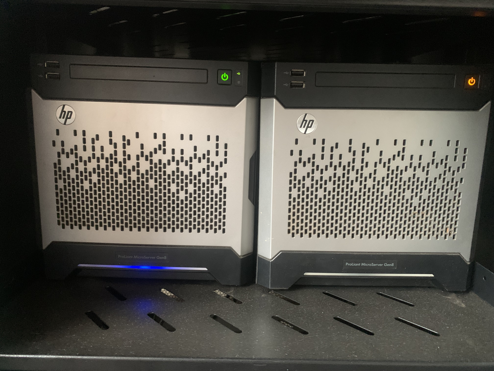
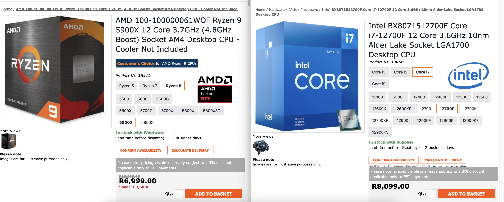
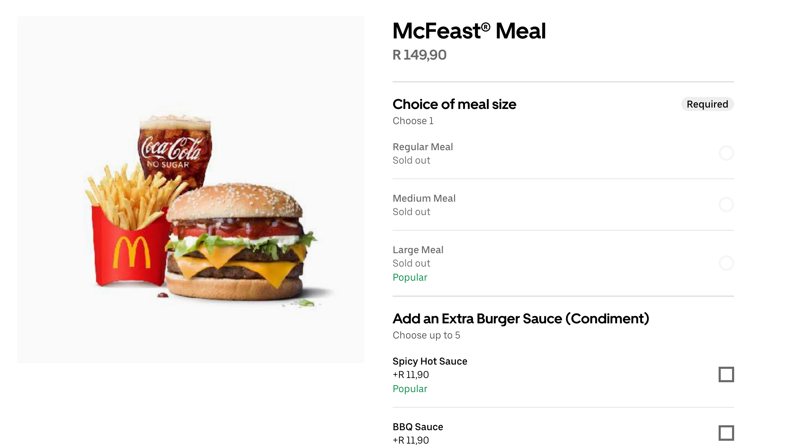
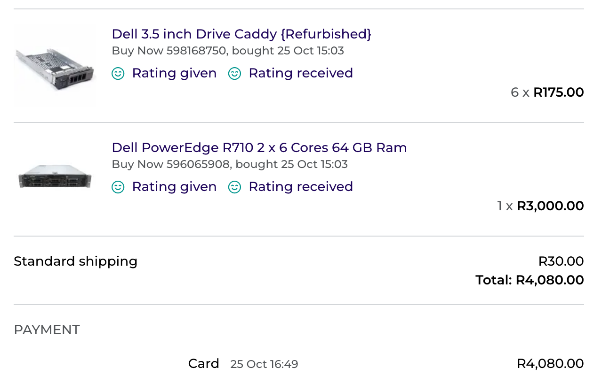
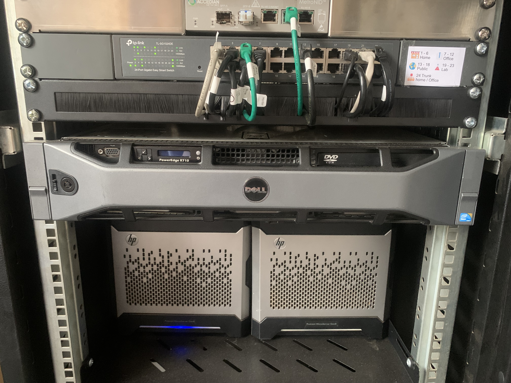
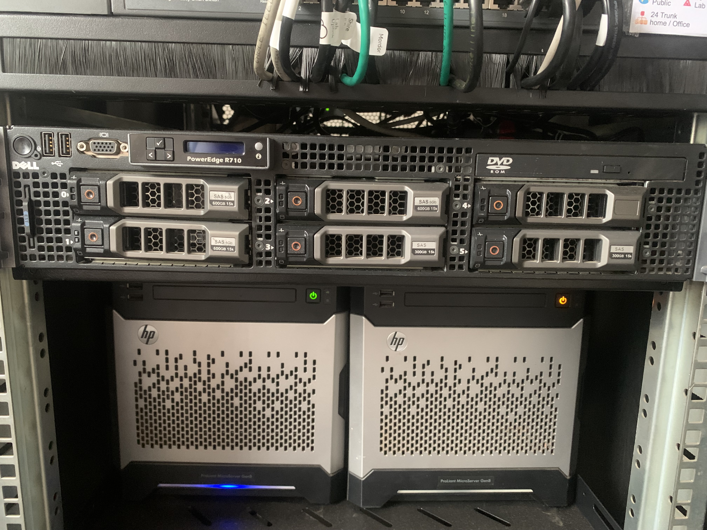
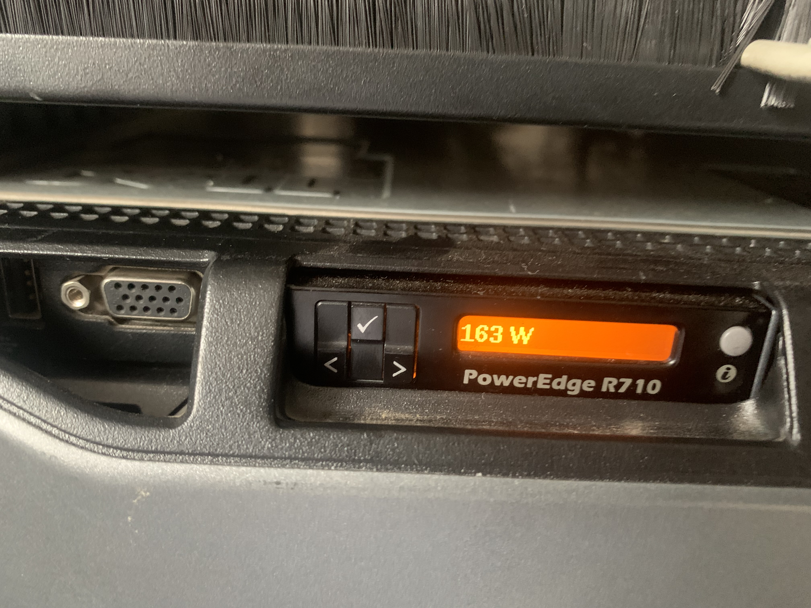
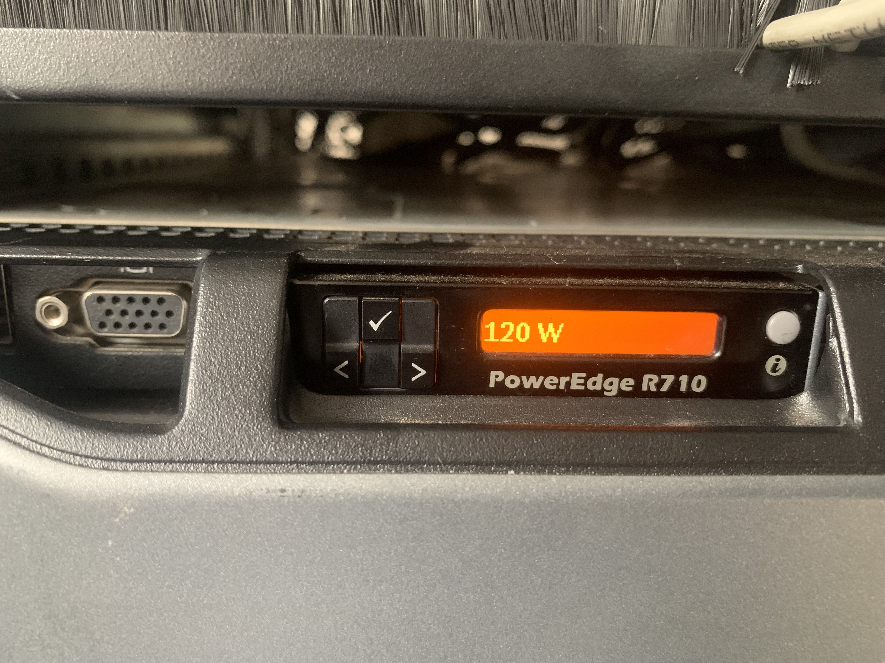

+++
author = "Jonathan Moss"
title = 'Old Server New Home Lab'
datePublished = 2023-12-04
description = "Is it worth using old hardware?"
tags = [
    "Hardware",
    "Home Lab",
]
categories = [
    "Hardware",
    "Home Lab",
]
series = ["Home Lab"]
image = "splash.jpeg"
draft = false
+++

## My Current Setup

For many years I have been using two HPE ProLiant MicroServer Gen 8's which are still running great till this day. I upgraded them with Xeon E31260L (4 cores, 8 threads) which is an energy efficient and powerful cpu. The only issue I have with the ProLiant is that the max supported RAM is 16GB on the motherboard itself.



As technologies have matured and become more and more complex. 16GB of RAM is just not enough to run all the software that I need to run either on a daily bases or when I need to run multiple virtual machines to test new software and configurations.
I decided to look into getting something more powerful and has more features for my work and home lab purposes. I will continue to use my ProLiant MicroServers for running my home network and services.

I noticed that there are a lot of Dell R710's floating around on the second hand market. It is the time were all companies are getting rid of all their old servers and moving to newer technologies. 

The price was great, the specs are fantastic, but is it still a good idea to use very old technologies for a testing and home lab server?

Please note that I'm not a master of hardware, I have a fair amount of experience using different hardware but I'm far from a hardware guru. If you need advice from experts, I would recommend visiting the Level 1 Techs forums https://forum.level1techs.com/

## Second Hand Dell R710 is it worth it?

The R710 server that I was looking at has two Xeon X5650's, 64 GB RAM, 8x Gigabit ports (2x 4 port gigabit cards), 2x 870 watt PSU's and a H700 RAID Controller which unfortunately does not support passthrough. I didn't do my research on the H700 before hand as I assumed that it would support passthrough as I'm so used to RAID controllers usually supporting that. In the end it is not too much of an issue for me, but it was a wake up call with regards to reminding me to always research every thing thoroughly first. 

The unit did not include any HDD caddies, so I had to get 6x caddies as well.

A X5650 has 6 cores 12 threads at a base frequency of 2.66 GHz and boosts to  3.06 GHz. The TDP is  95 W and can take up to 288 GB of DDR3 800/1066/1333 ecc RAM. It also support all the virtualization technologies (VT-x and VT-d) if needed, although I was also having issues with hardware passthrough.

The cost of the Dell R710 was R3000 (ZAR)
The cost of a HDD caddy was R175 each, I needed 6 (R1050 total)
Shipping was R30

Total cost is R4080

Really good deal in my opinion.

### What I looked for to see if it was worth purchasing?
#### Power draw and efficiency

Take these numbers with a grain of salt due to silicon lottery. However this is the approach I took when deciding if the Dell R710 will be a good purchase.

Browsing through the web and scouring forums, I could make out that a X5650 idles at around 45 - 55 Watts.
So a total of around 110 Watts for the pair. 

My ProLiant with the Xeon E31260L idles at around 35 - 45 Watts.
Which would bring the idle power usage around 10 Watts per CPU more then what I currently use. For me that is not too bad to have two more cores and 4 more threads available.

However, when doing heavy work loads, the power draw doubles from 45 Watts of the E31260L to 95 Watts of the X5650. So defiantly a lot more power usage for the extra two cores and 4 threads at full load.

I wanted to compare this to a modern 12 core 24 thread CPU to have a rough idea of what a more modern CPU would draw. 

An AMD 100-100000061WOF Ryzen 9 5900X 12 Core 3.7GHz has a TDP of 105 Watts

An Intel BX8071512700F Core i7-12700F 12 Core 3.6GHz has a TDP of 95 Watts - 180 Watts maximum at load.

They are all in a similar TDP range with regards to Watts per core and it is very clear that as technology improved, the modern CPU's will be more efficient and more powerful. But with regards to the workload I will be putting on the cpu, I won't be very disadvantaged with the frequency of the cpu. The 2.66 GHz to  3.06 GHz of the X5650 will be fine for my test and home lab needs.

It is also very important to know that depending on your workload, running two CPU's together can run slower than a single CPU with the combined cores. But I was interested in redundancy and having more RAM channels, using a dual socket motherboard will facilitate this.

#### Sound Pollution

Unfortunately server hardware is loud, sever fans can be extremely noise polluting, especially in a residential area. But with some tweaking, we will be able to almost make the server completely silent. I will create an article in the near future with how to achieve this.

#### Costs

The Second hand Dell R710 totals up to:
R4080

An AMD 100-100000061WOF Ryzen 9 5900X CPU only:
R6999 (At the time of writing this)

An Intel BX8071512700F Core i7-12700F:
R8099  (At the time of writing this)



To build a new complete server would by far cost more than purchasing an old fully configured server. With this already in mind, the Dell will be a good purchase.

To help take another approach to see if it would be worth it and cost effective, I did a quick calculation to see what it would cost daily in electricity if i did decide to run the Dell 24/7 at full load.

For the purpose of this calculation, I will set the Dells full load to be 200 Watts.
The cost per Kilowatt Hours at the time of writing this is:
R2.73 (ZAR)

```
cost = power rating × time × price

power rating = 200 W (We need to convert it to kWh)
kilowatt hours = (watts × hours) ÷ 1000
= (200 x 1) ÷ 1000
= 0.2 KW

cost per day = 0.2 x 24 x 2.73
= R13.10

cost per month = 13.10 x 30
= R393

cost per year = 13.10 x 365
= R4781.50
```

To put this in perspective, at the time of writing this, using Uber eats, a McDonalds McFeast® Meal costs R149.90. It costs less then three McFeast® Meals to run the Dell at full load for a month.

Another way to look at it is that I can purchase the Dell and use it 24/7 for a year and that will be close to the cost of only buying a new CPU. Then if we take the cost of a motherboard for that CPU, which is around another R4000. We can run the Dell 24/7 for two years at the same price. 



In my situation, going the Dell route is the better option than building a more modern server. I don't plan on running the server 24/7 as well, so it will defiantly be cheaper to run a second hand Dell R710.

## Conclusion

So of course I purchased the unit. It is now sitting comfortably in my server rack.







I decided it would be nice to share my experience and processes that I went through to set up and use the Dell.

I will be doing a mini series of articles about it and hopefully it will help some people along the way to setting up their own R710 server.

Below is the wattage use when the server starts up (Between 163 Watts - 175 Watts) and then at idle (Between 119 Watts - 123 Watts). This is the idle draw using Proxmox as the host OS, with an OpnSense Virtual Machine and an Ubuntu Virtual Machine running a few docker containers. I only have one PSU plugged in and have the fans tweaked to run slower. Very Nice.

Startup Wattage


Idle Wattage
