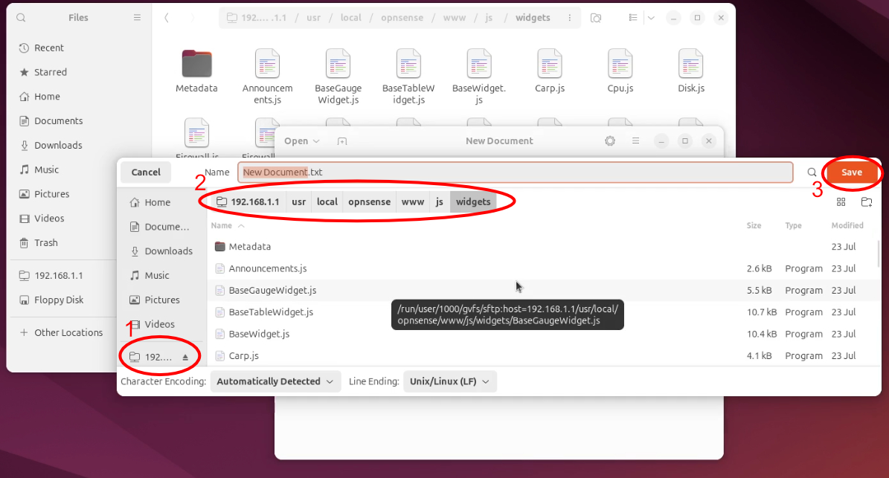

+++
author = "Jonathan Moss"
title = 'OpnSense - How To Create A Custom Dashboard Widget'
date = 2024-12-06
description = "In this guide we go over how to create an OpnSense Dashboard Widget"
tags = [
    "Software",
    "Development",
]
categories = [
    "Software",
    "Development",
]
series = ["OpnSense"]
image = "splash.jpg"
draft = false
+++

## Introduction

Here is a quick write up of how to create your own dashboard widget on OpnSense.  
At the time of writing this, I am using OpnSense version 24.7.
The original documents can be found at:   
https://docs.opnsense.org/development/frontend/dashboard.html
We will be taking the existing widgets and merge them into one big widget with our own styling and layout. The purpose on this guide is not to be a javascript and  html development tutorial, but instead show the basics of how to start developing a widget. 

The code and examples can be downloaded from GitHub:   
https://github.com/Jono-Moss/guides/tree/main/OpnSense%20Dashboard%20Widget

## The Development Environment
At the time of writing this, I was doing a few network designs and projects using GNS3.
So I decided to make a "Lab" on there and turn that into a small development environment.  
The lab consisted of 4 "Appliances":
1. Cloud - to give us access to the internet
2. OpnSense VM
3. An Ubuntu VM (We will use this as our development machine)
4. A basic switch (This is not really needed)


Make sure to set / change the "Console" setting for both  the OpnSense and Ubuntu VM to be "Spice Agent".  

Once the lab is setup, we will move to setting up the "Appliances"

### OpnSense VM
The first thing you will need to do is assign the interfaces so that OpnSense knows  
which is your WAN interface and  which is your LAN interface.  
This can be done by "Double Clicking" on the OpnSense Appliance, login using the default login details:  
user: root  
pass: opnsense   
Then using the "Assign Interfaces" option in the menu.

Once that id done, we need to enable ```SSH``` access for the root user so that we can access the files on OpnSense.  

I did this via the "Web UI", using the Ubuntu VM. Since the default LAN IP is set to be:  
192.168.1.1/24  
I "Double Clicked" on the Ubuntu VM to open it and used Firefox to access the "web UI" on 192.168.1.1.

From there head over to:  
System->Settings->Administration  
Then enable the ```Secure Shell Server```, ```Permit Root User Login``` and ```Permit Password Login```.  
Save and Apply the changes.  
We now are able to use sFTP to access the files on OpnSense.


### Ubuntu VM
You  may use whatever program you would like to use to develop the widget,  
since it is only HTML and Javascript, there is no need for any "heavy IDE".
I started just using Ubuntu's default text editor but moved to  installing VSCode as I
wanted things like code folding that I  was not getting from the default editor. 

## Widget File Structure
There are 4 main locations that you will use to store your files for dashboard widgets 
to work:  
- Widgets are stored in:  
/usr/local/opnsense/www/js/widgets/  
- Were your widgets "core file" will be stored:  
/usr/local/opnsense/www/js/widgets/Metadata/  
- CSS file for styling, however I suggest sticking to inline CSS:  
/usr/local/opnsense/www/css/dashboard.css  
- Images can be stored in the "themes" directory:  
/ui/themes/   

### Files That make The Widget
There are 2 main files that make a widget:
1. The "core" .xml file, which is used to register the widget in OpnSense and store "Localisation" info.
2. The "widget" .js file, which is where all the widget logic and UI is created.

The "core" file is stored in the ``` /usr/local/opnsense/www/js/widgets/Metadata/ ``` folder.  
You can name it anything you like, in this guide we will call it ```jonoCustomwidget.xml```

The "widget" file is created an stored in the ``` /usr/local/opnsense/www/js/widgets/ ``` folder.
You can name it anything you like, in this guide we will call it ```JonoCustom.js```

With that in mind, I will go over how to access the folders and files in order to start developing your widget.

## Accessing the folders and Files

Ubuntu's "file explorer" has the ability to access files directly using sFTP, so we can easily
access the files on OpnSense using that feature.

1. Open the "file explorer" and click on the ```Other Locations``` option at the bottom left. 

2. Then in the input at the bottom, you can use the following to access the files:  
    ``` ssh://opnsenseip ```  
    or  
    ``` sftp://opnsense-ip ```
So in this guide it will be:
    ``` ssh://192.168.1.1 ```  
    or  
    ``` sftp://192.168.1.1 ```   

3. You will be prompted to enter in your OpnSense credentials to get access. 
   
4. You will then be taken to the users home folder, in my case, since I logged into OpnSense using the root user, I will be taken to the root users home folder which is currently empty.  
    
5. From there, you can click on the "IP Address" at the top navigation pane and remove the "Trailing path", in this to go back out of the "root home" folder and out to the top most path / folder of OpnSense.  
So in my case I will change it from ``` sftp://192.168.1.1/root ``` back to  ``` sftp://192.168.1.1 ```
and then press the ```Enter``` key on my  keyboard to go to the main path.
    
6. We can now "visually" navigate the OpnSense file system easily.    
From here we will navigate to the main widget folder which is located at:  
``` /usr/local/opnsense/www/js/widgets/ ```   
    

## Create the Files
### The "Widget" File
We will start with creating the "widget" js file. To do this, open the IDE that you will use to develop the widget.  
In the IDE, create a new "js" file, navigate to the ``` /usr/local/opnsense/www/js/widgets/ ``` folder and save it.   
Since we have it open in the Ubuntu file explorer, we can access the folder via the UI by selecting it on the left menu panel.   
    
You can name it whatever you like, in this guide I will name it:
```JonoCustom.js```
### The "Core" File
Using the same steps as above. Create an XML file in the following folder, name it whatever you like:   
 ``` /usr/local/opnsense/www/js/widgets/Metadata/ ```
In this guide I named it ```jonoCustomwidget.xml```

## Let the Development Begin

The code and examples can be downloaded from GitHub:   
https://github.com/Jono-Moss/guides/tree/main/OpnSense%20Dashboard%20Widget

### The "Core" File
You can copy and paste the code below into your XML file, I will explain each section to you:   
``` xml
<metadata>
    <jonoCustomwidget>
        <filename>JonoCustom.js</filename>
        <link>https://jonomoss.com</link>
        <endpoints>
            <endpoint>/api/diagnostics/system/systemResources</endpoint>
        </endpoints>
        <translations>
            <title>Jono Custom Widget</title>
            <used>Used</used>
            <free>Free</free>
            <firewall>Firewall Logs</firewall>
            <action>Action</action>
            <time>Time</time>
            <interface>Interface</interface>
            <source>Source</source>
            <destination>Destination</destination>
            <port>Port</port>
            <matchedrule>Matched rule</matchedrule>
            <interfaces>Interfaces</interfaces>
            <services>Services</services>
            <noservices>No services found</noservices>
            <running>Running</running>
            <stopped>Stopped</stopped>
            <restart>Restart</restart>
            <stop>Stop</stop>
            <start>Start</start>
            <gateway>Gateways</gateway>
            <rtt>RTT</rtt>
            <rttd>RTTd</rttd>
            <loss>Loss</loss>
        </translations>
    </jonoCustomwidget>
</metadata>
```

1. The first parent "tag" in the XML file needs to be ```<metadata></metadata>``` this tells OpnSense what the content inside it will be linked to / be about.   
You need to always have this in the core file.
2. The next tag in the ```<metadata></metadata>``` will be what you want to call your widget.    In this case we will call it ```<jonoCustomwidget></jonoCustomwidget> ``` This is what you will see in the "Widget List" when adding it to the dashboard.
3. The next tag in the ```<jonoCustomwidget></jonoCustomwidget> ``` section is the ```<filename>JonoCustom.js</filename>```.   
This tells OpnSense what the name of the "Widget" js file is.   
In the previous file creation section. We create and named the "widget" file ```JonoCustom.js```.
So it is very important that it matches the name  of the file you created.
4. The ```<link>https://jonomoss.com</link>``` tag is not really used, but it is be a nice place to put a link to where a developer or user can get more info about the widget.
5.  The ```<endpoints></endpoints>``` section is where you will tell OpnSense what "endpoints" the widget will be using. From there OpnSense will see if the current logged in user has access to those endpoints (ACL). All the endpoints can be found in the development documentations at:  https://docs.opnsense.org/development/api.html      

**Important**
> In this guide and example I forgot to add all the end points. However since I login to the OpnSense web UI via the "root" user, the widget will still work. If however a user who does not have access to the endpoints uses this widget, they will run into errors. 

6. The ``` <translations></translations>``` section is used  for static text in your widget, you can give the tag any name and that will be used to reference the value  / text in it. ```<keyName></keyName>```. As an example, you  can create a "translation" with the key as ```<title>My Widget</title>``` and in the "widget" file, you can reference and use the "My Widget" text by using the  following code:   
```js 
${this.translations.title} 
``` 
### The "Widget" File
1. When creating your widget, your class has to extend one of the three base classes:   
BaseWidget   
BaseTableWidget   
BaseGaugeWidget   

The BaseTableWidget and BaseGaugeWidget both extend the BaseWidget but have some built in functions to be able to speed up the creation of either a "table" based widget or a "gauge" based widget.
when I started this guide, I was focusing on creating a "Firewall Log" widget. So I started by extending the ```BaseTableWidget```. However, as I got more knowledgeable and comfortable with how the widgets worked. I stopped using OpnSense's table functions and instead wrote my own. I did not change the extends to be ```BaseWidget```, however it does not really make a difference to my widget.

So in this guide the class we will create will be as follows:   
```js 
export default class Jono extends BaseTableWidget {}
```

2. There are 5 main functions that OpnSense triggers when you use your widget,   
The following are the main functions:

- constructor - Run once when widget is created   
- getMarkup - Run once when widget is started   
- onMarkupRendered - called once after "getMarkup" is completed   
- onWidgetTick - Run every tick, you can set the "tick rate" in the constructor, this is where you get and refresh the widgets data   
- onWidgetClose - Run once when widget is closed   

####  Constructor
The only things we will do in the constructor is set the "tick rate" and  add a "locked" variable that the "service" system needed to keep track of its state.

These variables are declared in the parent class, we are just setting the values in our child class.

#### getMarkup()
The getMarkup() function is then called after the constructor, this is used to create the main HTML structure of the widget.   
Since I want to have multiple widgets in one, my getMarkup() function was looking messy and become difficult to follow.   
So what I decided to do was  to create a separate  function for each widget section I wanted and then called them here.   
I have made comments in the file so it should be easy to follow. Doing it this way also allows for me to easily extract the different  widgets code out of this file and use them else where if I want to create a new widget in the future.   

The next thing that I did was to add a function that will include all the CSS into my widget. When I was using the CSS file that the OpnSense documents recommended   
```/usr/local/opnsense/www/css/dashboard.css```   
I noticed that after OpnSense did an update. All my CSS was removed from that file.   
So instead I decided to move all the CSS into the widget itself and add it to  the html in this getMarkup() function.   
Now updates will not interfere with the widget.

#### onMarkupRendered()
This is called after the getMarkup() function.   
The purpose of this function is to add more data to the main widget HTML structure
but could only be done once the initial structure is on the DOM.

#### onWidgetTick()
This is where the magic happens, all the data your widget need to get and then render to the screen is done here.   
Just like the above functions, I have created a separate function for each section so that it is more organised and easier for me to follow.   

The general process of the data fetching and updating goes as follows:  
1. If needed, clear the existing data from the DOM (remove from section) 
2. Call and get the data from the api endpoint.
3. Once the data is received, map the data to an HTML object / snippets.
4. Append or replace the data to the main HTML structure.
5. When the next tick is met, repeat.

#### onWidgetClose()
The last function onWidgetClose() calls the onWidgetClose() function in the parent class. This does garbage collection and destructor things. 

## The dangers of downloading widgets
As a side note, please be very careful of just downloading and  using any widget.
Since you can run basically any javascript and HTML code, a bad actor can inject malicious code and
get access to information you  do not want them to have.
A quick example could be:    
A form with hidden fields can be added to the widget, for example "username" and "password".    
Your browser could then auto fill the fields with saved data you have (for example your login details you log into OpnSense with) and then using javascript, can then auto send those details
to them.   
So be very careful and make sure to always check the code before using it on your own OpnSense instance.  