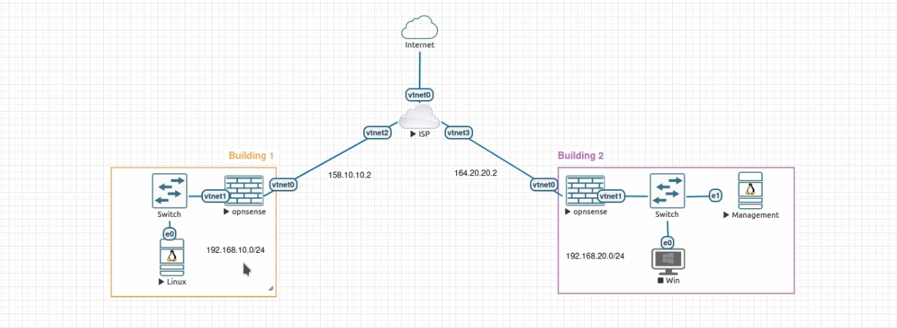
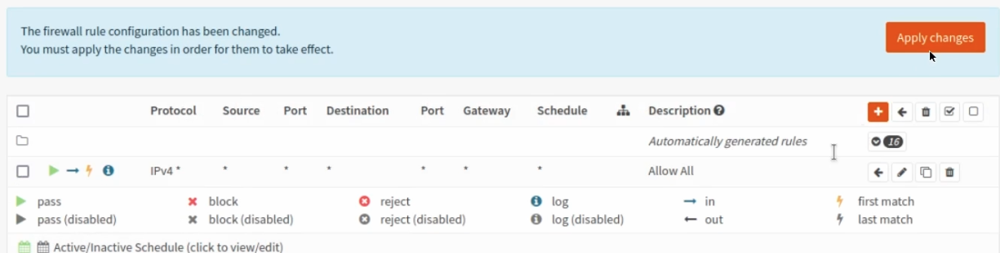
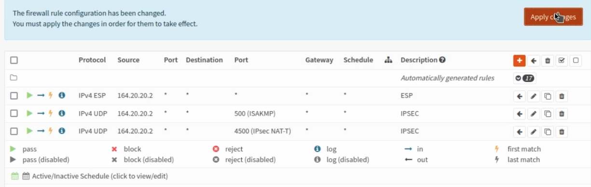
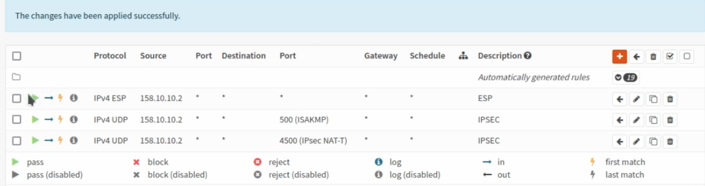

+++
author = "Jonathan Moss"
title = 'OpnSense IPSec (Point to Point) connections (Policy based)'
date = 2024-08-28
description = "In this video we go over how to setup IPSec VPN (Point to Point) connections (Policy based) in OpnSense"
tags = [
    "Software",
    "Home Lab",
    "Networking",
]
categories = [
    "Software",
    "Home Lab",
    "Networking",
]
series = ["OpenSense"]
image = "lab.png"
draft = false
+++


 
## Introduction
This is how to connect two instances together using an IPSec connection. 
When setting up IPsec VPNs there are two main types of scenario’s with their own advantages and disadvantages. The two main types are:
Policy based
Route based (VTI)

The main difference between the two is that the "VTI" method has the advantage that allows you to use standard or advanced routing technologies to forward traffic around tunnels.
The Policy based method is easier and quicker to setup, however has. less flexibility.

This guide will focus on setting up a "Policy Based" connection. 

## Initial Setup
Each instance needs to have at least one unique LAN IP subnet for each side of your connection. If you use the same subnet on both instances, OpnSense will route the traffic to the local subnet and not to the other instance.

### Building A
Hostname: build1  
WAN IP: 158.10.10.2  
LAN Net: 192.168.10.0/24  
OPNSENSE IP: 192.168.10.1  
LAN DHCP Range: 192.168.10.100-192.168.10.200

### Building B
Hostname: build1  
WAN IP: 164.20.20.2  
LAN Net: 192.168.20.0/24  
OPNSENSE IP: 192.168.20.1  
LAN DHCP Range: 192.168.20.100-192.168.20.200

## Setup

### Step 1 - Key pairs
Go to the VPN->IPsec->Key Pairs option in the menu and create a new key on both hosts, then copy the public part from Site A to Site B and vise versa. Keys may easily be generated with the gear button in the Key type field.

| Property | Name | Key Type           | Generate |
| -------- | ---- |------------------- | -------- |
| site A   | B1   | ECDSA - NIST P-384 | Yes      |
| site B   | B2   | ECDSA - NIST P-384 | Yes      |

Click on the "Gear" Icon to Generate a key.
Then using the Public Key Generated at each location From The Above:

| Property | Name | Key Type           | Public Key    | Private Key |
| -------- | ---- |------------------- | ------------- | ----------- |
| site A   | B2   | ECDSA - NIST P-384 | B2 Public Key | Blank       |
| site B   | B1   | ECDSA - NIST P-384 | B2 Public Key | Blank       |

Click Save.

### Step 2 - Setting up the IPsec connection

In order to setup a simple (and common) IPsec connection, we go to   
VPN->IPsec->Connections and add a new entry.

#### General settings

Side by side the following general settings need to be set in this case, which configures the first part of the security association between both sites:

| Property | Local addresses | Remote addresses |
| -------- | --------------- |----------------- |
| site A   | 158.10.10.2     | 164.20.20.2      |
| site B   | 164.20.20.2     | 158.10.10.2      |

Press <save> to go to the next step.

#### Authentication

Next we will need to add local authentication (add a new record in the local grid):

| Property | Authentication | Id    | Public Keys |
| -------- | -------------- | ----- | ----------- |
| site A   | Public Key     | hostA | hostA-key   |
| site B   | Public Key     | hostB | hostB-key   |

Then we need to set Pre-Shared Key for remote authentication as well:

| Property | Authentication | Id    | Public Keys |
| -------- | -------------- | ----- | ----------- |
| site A   | Public Key     | hostB | hostB-key   |
| site B   | Public Key     | hostA | hostA-key   |

#### Children

Finally we may add a child which will add security policies and kernel routes.

| Property | Mode   | Policies | Local           | Remote          |
| -------- | ------ | -------- | --------------- | --------------- |
| site A   | Tunnel | checked  | 192.168.10.0/24 | 192.168.20.0/24 |
| site B   | Tunnel | checked  | 192.168.20.0/24 | 192.168.10.0/24 |

Save and apply

Finally save the settings and check the "IPSEC" checkbox. hit apply on the connections page to establish the tunnel.

### Validate

Now can check if the tunnel is active on both side using the status overview in   
VPN->IPsec->Status Overview

### Install firewall policies
With the tunnel active, all that remains is to accept traffic on this tunnel using the Firewall->Rules->IPsec menu option.

In this guide I will just create a rule to allow all IPv4 traffic through, however in production you should only allow the traffic you want through. Do this for both buildings

Then Add the following Wan Rules:
Firewall->Rules->WAN

UDP  port 500  
UDP port 4500  
ESP

Remember to set the source as the WAN IP from the opposite building.
So for building 1, The source will be building 2's IP and vice versa.  

Building 1 rules  below:

Building 2 rules  below:

## Extra Optionals

See the original OpnSense Documents for more information:
 https://docs.opnsense.org/manual/vpnet.html#ipsec

### Tuning considerations

Depending on the workload (many different IPsec flows or a single flow), it might help to enable multithreaded crypto mode on ipsec, in which case cryptographic packets are dispatched to multiple processors (especially when only a single tunnel is being used).

In order to do so, add or change the following tunable in System ‣ Settings ‣ Tunables:

Note
- net.inet.ipsec.async_crypto = 1

To distribute load better over available cores in the system, it may help to enable receive side scaling. In which case the following tunables need to be changed:

Note
- net.isr.bindthreads = 1
- net.isr.maxthreads = -1 <– equal the number of cores in the machine
- net.inet.rss.enabled = 1
- net.inet.rss.bits = X (The amount of cores, see below)
For rss bits use the following values:
    for 2-core systems, use ‘1’
	for 4-core systems, use ‘2’
    for 8-core systems, use ‘3’
    for 16-core systems, use ‘4’
    Etc.
	
You will need to **reboot** the OpnSense Instance for the settings to work.

### Note regarding IPS and rss

When Suricata is running in IPS mode, Netmap is utilized to fetch packets off the line for inspection. By default, OPNsense has configured Suricata in such a way that the packet which has passed inspection will be re-injected into the host networking stack for routing/firewalling purposes. The current Suricata/Netmap implementation limits this re-injection to one thread only. Work is underway to address this issue since the new Netmap API (V14+) is now capable of increasing this thread count. Until then, no benefit is gained from RSS when using IPS.

