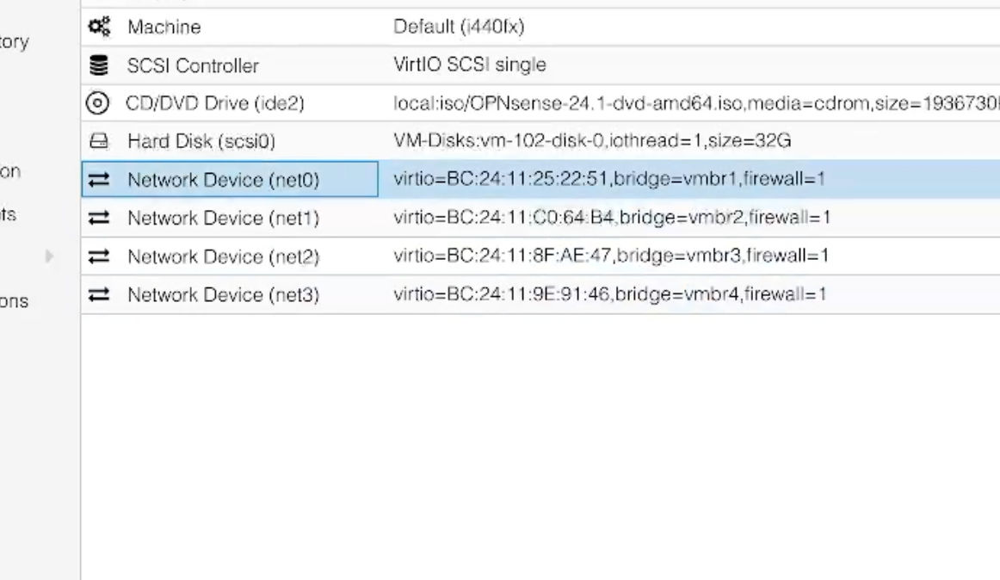
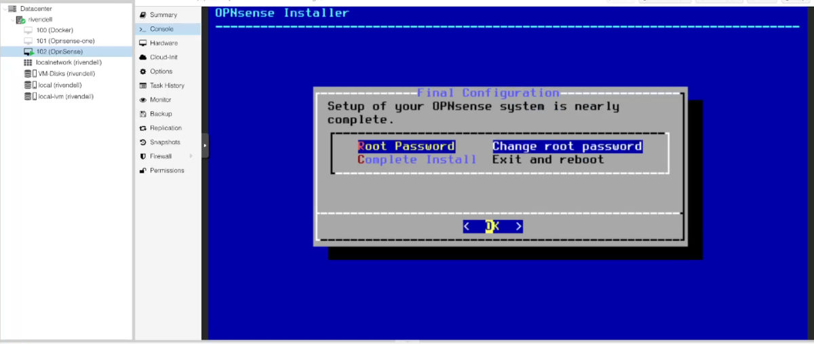
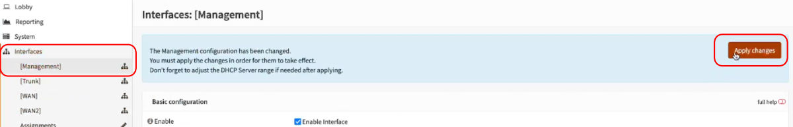

+++
author = "Jonathan Moss"
title = 'OpnSense Virtual Machine Installation on Proxmox'
date = 2024-02-12
description = "This is a guide on how to create an OpnSense virtual machine on Proxmox."
tags = [
    "Software",
    "Home Lab",
    "Networking",
    "Virtual Machine",
]
categories = [
    "Software",
    "Home Lab",
    "Networking",
    "Virtual Machine",
]
series = ["OpenSense"]
image = "splash.jpg"
draft = false
+++

## Introduction

The first step in creating our new OpnSense VM, is to get our network bridges setup and ready to use. Once we have that in order, we will move onto creating the virtual machine and attaching the network bridges to it.

We will then move onto Installing OpnSense onto the virtual machine and do some initial configurations in the OpnSense shell.

Lastly we will login to the OpnSense Web UI to add and configure all the network interfaces and services. 

This is going to be a long but very fun project, let's get started.

## Figuring out what port belongs to which network name

1. An easy way on how to know which physical port belongs to the port name in Proxmox, is to do the following:
    
    Open Up two Proxmox web UI instances in your browser. One will have the "Network" section open and the other we will have the "Shell" open. Ps since my screen has a small real estate to work on, I will just have them open in tabs rather than two windows.

    

2. Using the following command in the shell, we can see which network ports are in the "UP" state:

    ``` bash 
    ip a | grep 'state UP'
    ```

    If i run that now, I will see that the main Proxmox connection (Port and bridge) is up.

    

    So it shows that ```eno1``` and ```vmbr0``` is up. If we check on the "Network" section we can see that it is indeed the main Proxmox connections and it is up since we are currently connected to it.

    

*Just as a side note, remember to always label your cables to help with avoiding the headache of having to trace cables in the future.*


3. We will now use this method to figure out the name of the port we will be using for our first "WAN" connection.

    Connect your first WAN cable in to the port you want to use, in this case, the first port of the first NIC. See the "Home Lab Network Design" post for the diagram I'm using to set up my network: 
    https://jono-moss.github.io/post/home-lab-network-design-26-01-2024/ 

       

    Now do the same command as in the previous step and we should now see the name of the port associated to it:

    From the screenshot below, we can see the port is named "enp7s0f0"

    

    With this information, we can add a comment to that port so we will know in the future, what it is used for.

    

4. We will repeat this process with the next WAN port. We will unplug the connection from the first port and will plug it into the third port to see what we get. Then we can create a comment on that port.

    

    

    

5. From the above results, we can now make the conclusion that the last two ports will be the following: 
```enp7s0f1``` will be our ```Management``` network and ```enp9s0f1``` will be our ```Trunk``` network. We can add comments to them and we are now ready to create the bridges.


## Setup the network bridges on Proxmox

1. Click on the "Create" button and choose the "Linux Bridge" option.


2. Under the "Bridge Port" input, we will put in the name of the first WAN port, in this case it is ```enp7s0f0```. We can also give it a comment like "OP WAN1" so that we will know wht this new bridge network will be for.


3. Repeat this process for all the other ports till you have 4 new bridge connections.


4. Now the last setting we need to enable is the "VLAN Aware" option on the "Trunk" bridge. This will let Proxmox know that VLAN traffic will be used on it.


5. Once completed, click on the "Apply Configuration" button and accept the confirmation dialog to save the networks.


We are now ready to move onto downloading the OpnSense ISO.

## Downloading the OpnSense ISO

1. Goto the OpnSense download page and make sure to get the "DVD" version.
https://opnsense.org/download/


2. Extract the iso from the .bz2 file. Please not that on MacOS you will need a 3rd party extraction tool. In my case I used an app called "The Unarchiver".


3. On Proxmox, goto the "local" drive and select the "ISO Images" menu.
From there select the "upload" button.


4. Click on the "Select File" button and find the iso file you downloaded. Then click on the "Upload" button to begin the upload.


5. The ISO will be uploaded and we can now move to creating the virual machine.


## Creating the Virtual Machine

1. Click on the "Create VM" blue button on the top right of the Proxmox UI.


2. Make sure the "Advanced" box is checked. It is next to the "Back" button.


3. Give the VM a name, in this case I will call it "OpnSense". 
Enable the "Start at boot" box and set the "Start/Shutdown Order" to "1". This will make sure that OpnSense is the first VM to start when Proxmox boots up. 
Click on the "Next" button once you have done so. 


4. Select the "OpnSense" ISO we uploaded in the previous section and then click on the "Next" button once you have done so. 


5. We will leave the settings in the "System" section as is, Click on the "Next" button.


6. We will also leave the "Disks" section as is. Since I would like to install plugins and have "IPS/IDS" data and other block lists. 32GB will be enough space for the VM.


7. For the CPU "Type", We will set it to "host", this will allow OpnSense direct access to the CPUs "instruction sets" for better performance. I will also give the VM 4 cores so that there will be enough cores for when we start using things like "IPS/IDS" and VPNs. 
Click on the "Next" button once you have done so. 


8. For the RAM, I will give the VM 4GB for the same reason as above. I will leave on "Ballooning", so that when the VM is not using all the RAM, it can be used elsewhere. Click on the "Next" button once you have done so. 


9. For the network section, we will add the first network to it (vmbr1). We will add the other bridges to the VM in a bit. PS I forgot to turn off the "Firewall" option. I turned it off ofter I added all the connections to the VM. Click on the "Next" button once you have done so. 


10. You can continue to click on the "finish" button to complete the VM creation. 


11. Now all that is left is to add the last three bridge connections to the VM. 

With the VM selected, open the "Hardware Device" section, Click on the "Add" button and select the "Network" option.


12. Now like in step 9, set the Bridge to "vmbr2" and tick off the "Firewall" option, just I reminder, I forgot to turn off the "Firewall" option here but corrected that once I noticed I forgot to do it. Click on the "Add" button once you have done so. 


13. Repeat step 11 for "vmbr3" and "vmbr4" until you have all four bridges attached to the vm.




## Installing OpnSense

1. Make sure that there are no Network cables plugged into the OpnSense ports. We will connect them later.

2. Click on the "Start" button and then open the VM's "Console"


3. Wait for the OpnSense to boot up, it took around 2 minutes to do so. When it is ready, you will be presented with a login prompt.


4. Login using the following details:

``` bash
login: installer
password: opnsense
```

You will be presented with a menu where we can start the installation process.


5. Choose the "Keymap" you would like to use, in my case it is the "default". Use the "Up" and "Down" arrows to highlight your choice, then press the "Space bar" to select your option. Once selected press "Enter / Return" on your keyboard to continue to the next screen.

6. Next I will choose the "Install (UFS)" option, if you would like to use "ZFS" you can.


7. We will then choose the "da0" drive which is the 32GB disk we created as the installation media to install OpnSense on.


8. You will be presented with a confirmation prompt to create a swap partition. Accept it to continue.


9. You will then be prompted to confirm your choices. Select "Yes" to continue.


10. OpnSense will start to install, this can take around 4 minute plus to install.


11. Once the installation is completed, You will be presented with a menu to change the "root" password. It is recommended to do so.




12. When you are ready, Select the "Complete Install" option.
When you select it, go into the "Hardware" section of the VM again and unmount the ISO.


13. Well done. The VM will restart and boot again into the installed OpnSense instance.


## Creating the networks in OpnSense terminal

1. Connect the WAN 1 cable into the WAN Port 1, and Connect a cable into the "Management" Network. We will use this "Management LAN" connection to connect directly to the OpnSense web UI later on.


2. Login to OpnSense with the root user and the password you set during the installation stage. Once logged in, you will be presented with a menu where we can do the first network setup.


3. Type "1" and press "Enter / Return" to start the "Assign Interfaces" process.


4. Type "n" for the "LAGGs" and "VLANs" options.


5.  Next we will be asked to assign the "WAN" connection. In proxmox, we attached the first "WAN" bridge to the VM and it is called "net0".
This will be called "vtnet0" on OpenSense. So we will now type "vtnet0" and press "Enter / Return" to assign that as the WAN.


6. You will now be asked to assign the "LAN" network. This network will become our "Management" network. So for this, type "vtnet1" and press "Enter / Return" to assign it.


7. You will now be asked if you would like to assign another network or end the assignment process. We will press "Enter / Return" to end and complete the assignments as we will now move on to logging in to the OpnSense web UI to add and edit the networks. 


8. Now we will be able to see that the two networks are up and running. You will be presented the the current IP addresses of the new networks we have just assigned / created. In this case we are indeed connected to our first WAN connection as we where givin the IP address of "172.16.0.3" and OpnSense created a LAN connection with the range of "192.168.1.1/24".


9. You can now type in "0" and press "Enter / Return" to logout of the shell.

## Creating the last two networks in OpnSense web UI
### Connect the last cable

1. We can now plug in the second WAN cable into our OpnSense VM as we are going to create that interface and network soon.


### Assigning the interfaces

1. Connect your laptop / PC directly to the LAN network we just created, (the to be management network). OpnSense will give you an IP 
address in the range of the Lan "192.168.1.1/24". So I was given "192.168.1.101"


2. We can now login to the OpnSense Web UI by going to
https://192.168.1.1
You can allow the security warning as OpnSense is using a self signed certificate.


3. Once logged in, you will most probably be presented with a "Set up wizard" screen. We will not go through the wizard as we will manually continue to do the set up. So you can click on the "Dashboard" menu under the "Lobby" section.


3. Click on the "Assignments" menu under the "Interfaces" section. Here we will assign the last two interfaces.


4. In the device list, select "vtnet2" and in the description type in "WAN2" as this will be the second WAN interface. Click on the "Add" button when done so.


5. Repeat this with "vtnet3" and in the description type in "TRUNK" as this will be the trunk interface. Click on the "Add" button when done so.


6. Now click on the "Save" button to complete the assignments.


### Enabling the interfaces and setting IPs

1. Now we need to enable the interfaces and set their IP types.
Click on the "TRUNK" interface that we just created.


2. Click on the "Enable" box. We will leave the rest of the interface settings as is for now. Since we will be using it as a "trunk" connection. It will not be getting an IP address as it will be used to accommodate multiple VLAN networks.

Scroll down and click on the "Save" button to continue. You can Ignore the "Apply Configurations" message for now as we will do that once we have completed editing all the settings.


3. Click on the "WAN2" interface and click on the "Enable" box.


4. Set the "IPv4" type to "DHCP" and click on the "Save" button to continue.


5. We can now click on the "Apply Configurations" button to finalise the configurations and apply them. Please take note that this can take a few minutes to apply, if you see it loading for more than two minutes, don't panic as it does take time.


6. If we now go back to the "Dashboard" and scroll down to the "Interfaces" widget. We will see that everything is in order, both the WAN connections are getting an IP address, and the trunk interface is active.


## Changing the Name, IP address and DHCP range of the management network

The last step we will do on this guide is set up the management network. In the next guide we will setup the managed switch to help distribute the management network and we will setup a Wifi access point for easier connection to the lab.

1.  Click on the "LAN" Interface under the "Interfaces" section. Change the description from "LAN" to "Management".


2. Since I won't be using IPv6, I will disable it by setting the type to "none".


3. Scroll down and change the IP address to "10.0.0.1". This will be the IP address range that we will use for all our management devices and software.


4. Click on the "Save" button to continue.

5. Before we apply the settings, we need to change the DHCP range to be in the "10.0.0.0/24" subnet. 

Under "Services", then "ISC DHCPv4", click on the "Management" option.


You will notice that the old range is not in the same subnet as the new IP range. So we will change it now.


6. Put in the IP range you would like, in this case i will use:
"10.0.0.10" to "10.0.0.60"


7. Click "Save" to finalise the DHCP changes.


Note that once it is saved, the DHCP service will be stopped due to the fact that we have not "Applied" the changes to the "Management" interface yet (step 4).

We will do that now.


8. Go back to the "Management" Interface and click on the "Apply Configurations" button to complete the setup.



9. This will once again take a few minutes to "Apply" and take effect. 
Wait for about two minutes and then do the following:

Now since we have changed the IP address of the interface, we need to unplug and plug the cable back into the laptop / PC to get the new IP in the 10.0.0.0/24 range.


This is good news as it means the Management network is completed.

10. Now we can goto 
https://10.0.0.1
to login to the OpnSense UI again.


11. Once logged in, scroll down to the "Interfaces" widget. We will see that everything is still in order, both the WAN connections are getting an IP address, the trunk interface is active and our "Management" network is on the new IP range.


## Conclusion

We now officially have an OpnSense VM running and ready to be used in our Lab. In the next guide I will go through how to once again split the managed switch into more parts for us to join our management network to and then move the Proxmox instance to. We will also add a Wifi access point to the network for easier connection to our Lab.

Have fun with your new OpnSense VM.