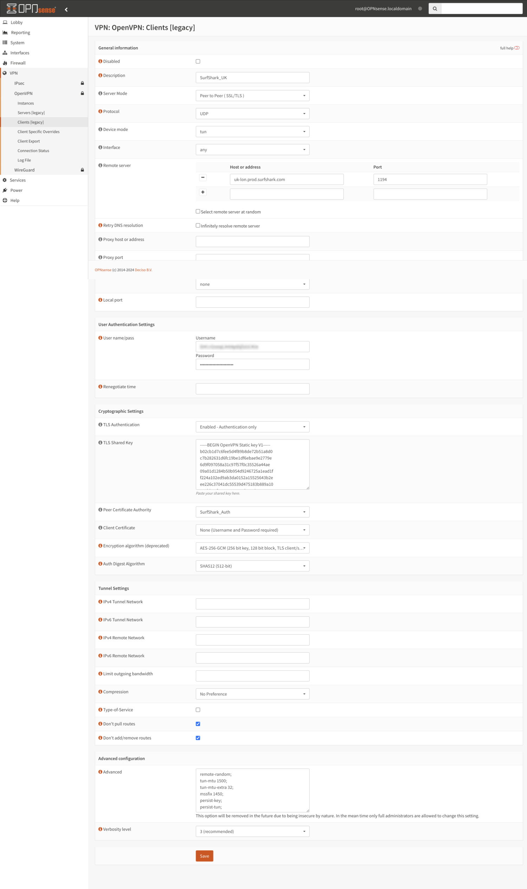

+++
author = "Jonathan Moss"
title = 'Setup Surfshark OpenVPN Client on OpnSense'
date = 2024-03-22
description = "In this video we will setup Surfshark OpenVPN client on OpnSense."
tags = [
    "Software",
    "Home Lab",
    "Networking",
]
categories = [
    "Software",
    "Home Lab",
    "Networking",
]
series = ["OpenSense"]
image = "splash.jpg"
draft = false
+++

## Intro

In this guide we will setup up a VPN client on OpnSense, this will allow us to create a gateway that we can use
for all traffic we would like to use through a VPN. A common use is to route all IOT devices through the VPN
connection so that our "real" public IP address can not be seen by these kind of devices.

Setting up a Client VPN requires four main steps:
1. Add VPN server as a "Certificate Authority"
2. Create the VPN Client
3. Assign and Enable the interface
4. Set up the outbound firewall rules

I have decided to use Surfshark as my VPN service since I have been using them for years, however you can do this with any OpnVPN provider (AirVPN for example).
I would recommend that you double check the providers support / manuals for their recommended settings,
but this guide will give you a starting point on how to get started. 

A Full guide by Shurfshark can be found here:
https://support.surfshark.com/hc/en-us/articles/12434921071890-How-to-set-up-Surfshark-on-an-OPNsense-router

However a lot of steps that are incorrect in their guide and do not work for my setup, the DNS steps in particular. 
This guide is the steps that I used to set this all up. 

If you are interested in using Surfshark, you can use my affiliate link:
https://surfshark.club/friend/7p3dwxCf

For more information about the referral program:
https://surfshark.com/refer-a-friend

## Get your Surfshark credentials and server location
Login to your Surfshark account and go to the following link to get your credentials and to see a list of VPN server locations you can connect to:
https://my.surfshark.com/vpn/manual-setup/main/openvpn

## Add Surfshark to our "Certificate Authority"

1. Navigate to System > Trust > Authorities and click on the +Add button. Once there, you should be able to see the window below:


2. Give it a "Descriptive Name", in this case I will call it ```SurfShark_Auth```

3. Copy and paste the following Certificate data in to the "Certificate Data" field

``` bash
-----BEGIN CERTIFICATE-----
MIIFTTCCAzWgAwIBAgIJAMs9S3fqwv+mMA0GCSqGSIb3DQEBCwUAMD0xCzAJBgNV
BAYTAlZHMRIwEAYDVQQKDAlTdXJmc2hhcmsxGjAYBgNVBAMMEVN1cmZzaGFyayBS
b290IENBMB4XDTE4MDMxNDA4NTkyM1oXDTI4MDMxMTA4NTkyM1owPTELMAkGA1UE
BhMCVkcxEjAQBgNVBAoMCVN1cmZzaGFyazEaMBgGA1UEAwwRU3VyZnNoYXJrIFJv
b3QgQ0EwggIiMA0GCSqGSIb3DQEBAQUAA4ICDwAwggIKAoICAQDEGMNj0aisM63o
SkmVJyZPaYX7aPsZtzsxo6m6p5Wta3MGASoryRsBuRaH6VVa0fwbI1nw5ubyxkua
Na4v3zHVwuSq6F1p8S811+1YP1av+jqDcMyojH0ujZSHIcb/i5LtaHNXBQ3qN48C
c7sqBnTIIFpmb5HthQ/4pW+a82b1guM5dZHsh7q+LKQDIGmvtMtO1+NEnmj81BAp
FayiaD1ggvwDI4x7o/Y3ksfWSCHnqXGyqzSFLh8QuQrTmWUm84YHGFxoI1/8AKdI
yVoB6BjcaMKtKs/pbctk6vkzmYf0XmGovDKPQF6MwUekchLjB5gSBNnptSQ9kNgn
TLqi0OpSwI6ixX52Ksva6UM8P01ZIhWZ6ua/T/tArgODy5JZMW+pQ1A6L0b7egIe
ghpwKnPRG+5CzgO0J5UE6gv000mqbmC3CbiS8xi2xuNgruAyY2hUOoV9/BuBev8t
tE5ZCsJH3YlG6NtbZ9hPc61GiBSx8NJnX5QHyCnfic/X87eST/amZsZCAOJ5v4EP
SaKrItt+HrEFWZQIq4fJmHJNNbYvWzCE08AL+5/6Z+lxb/Bm3dapx2zdit3x2e+m
iGHekuiE8lQWD0rXD4+T+nDRi3X+kyt8Ex/8qRiUfrisrSHFzVMRungIMGdO9O/z
CINFrb7wahm4PqU2f12Z9TRCOTXciQIDAQABo1AwTjAdBgNVHQ4EFgQUYRpbQwyD
ahLMN3F2ony3+UqOYOgwHwYDVR0jBBgwFoAUYRpbQwyDahLMN3F2ony3+UqOYOgw
DAYDVR0TBAUwAwEB/zANBgkqhkiG9w0BAQsFAAOCAgEAn9zV7F/XVnFNZhHFrt0Z
S1Yqz+qM9CojLmiyblMFh0p7t+Hh+VKVgMwrz0LwDH4UsOosXA28eJPmech6/bjf
ymkoXISy/NUSTFpUChGO9RabGGxJsT4dugOw9MPaIVZffny4qYOc/rXDXDSfF2b+
303lLPI43y9qoe0oyZ1vtk/UKG75FkWfFUogGNbpOkuz+et5Y0aIEiyg0yh6/l5Q
5h8+yom0HZnREHhqieGbkaGKLkyu7zQ4D4tRK/mBhd8nv+09GtPEG+D5LPbabFVx
KjBMP4Vp24WuSUOqcGSsURHevawPVBfgmsxf1UCjelaIwngdh6WfNCRXa5QQPQTK
ubQvkvXONCDdhmdXQccnRX1nJWhPYi0onffvjsWUfztRypsKzX4dvM9k7xnIcGSG
EnCC4RCgt1UiZIj7frcCMssbA6vJ9naM0s7JF7N3VKeHJtqe1OCRHMYnWUZt9vrq
X6IoIHlZCoLlv39wFW9QNxelcAOCVbD+19MZ0ZXt7LitjIqe7yF5WxDQN4xru087
FzQ4Hfj7eH1SNLLyKZkA1eecjmRoi/OoqAt7afSnwtQLtMUc2bQDg6rHt5C0e4dC
LqP/9PGZTSJiwmtRHJ/N5qYWIh9ju83APvLm/AGBTR2pXmj9G3KdVOkpIC7L35dI
623cSEC3Q3UZutsEm/UplsM=
-----END CERTIFICATE-----
```


4. Save the certificate. You will see that the certificate is valid until 2028 from Surfshark.


## Creating the client connection

1. Navigate to VPN > OpenVPN > Clients (Legacy) and click on the +Add button. Once there, you should be able to see the window below:


2. Fill in the following:

Description: Any name you like, for example, ```ShurfShark_UK```
Server mode: Peer to Peer (SSL/TLS);
Protocol: UDP (you can also use UDP4);
Device mode: tun
Interface: any

Remote server:
Host or address: ```uk-lon.prod.surfshark.com``` (change to the hostname of the server you are going to use chosen from the "Get your Surfshark credentials and server location" section)
Port: 1194

Retry DNS resolution: UnCheck
Proxy host or address: Leave blank
Proxy port: Leave blank
Proxy Authentication: None

USER AUTHENTICATION SETTINGS
Username/Password: fill in your Surfshark Credentials from "Get your Surfshark credentials and server location" section

CRYPTOGRAPHIC SETTINGS:
TLS Authentication: Enabled – Authentication only
TLS Shared Key: Paste the contents below

```bash
-----BEGIN OpenVPN Static key V1-----
b02cb1d7c6fee5d4f89b8de72b51a8d0
c7b282631d6fc19be1df6ebae9e2779e
6d9f097058a31c97f57f0c35526a44ae
09a01d1284b50b954d9246725a1ead1f
f224a102ed9ab3da0152a15525643b2e
ee226c37041dc55539d475183b889a10
e18bb94f079a4a49888da566b9978346
0ece01daaf93548beea6c827d9674897
e7279ff1a19cb092659e8c1860fbad0d
b4ad0ad5732f1af4655dbd66214e552f
04ed8fd0104e1d4bf99c249ac229ce16
9d9ba22068c6c0ab742424760911d463
6aafb4b85f0c952a9ce4275bc821391a
a65fcd0d2394f006e3fba0fd34c4bc4a
b260f4b45dec3285875589c97d3087c9
134d3a3aa2f904512e85aa2dc2202498
-----END OpenVPN Static key V1-----
```

Peer Certificate Authority: ```SurfShark_Auth```
Client Certificate: None (Username and Password required)
Encryption Algorithm: AES-256-GCM (256 bit key, 125 bit block, TLS client \ server mode only)
Auth Digest Algorithm: SHA512

TUNNEL SETTINGS:
IPv4 tunnel network: Leave blank
IPv6 tunnel network: Leave blank
IPv4 remote network: Leave blank
IPv6 remote network: Leave blank
Limit outgoing bandwidth: Leave blank
Compression: No Preference
Type-of-service: Leave unchecked
Don’t pull routes: Check
Don’t add/remove routes: Check

ADVANCED CONFIGURATION:
Advanced: Paste the contents down below
```bash
remote-random;
tun-mtu 1500;
tun-mtu-extra 32;
mssfix 1450;
persist-key;
persist-tun;
reneg-sec 0;
remote-cert-tls server;
```

Verbosity level: 3 (recommended)



6. Click on Save.


7. Navigate to VPN > OpenVPN > Connection Status
You should see that the connection is "Connected".


## Assigning and Creating the Interface

1. Navigate to Interfaces > Assignments

2. Add the "VPN" interface and give it a Description.


3. Click on the "Add" button and then the "Save" button.

4. Navigate to the new interface you just created and then check the "enabled" checkbox.
Scroll down to the bottom of the page and "Save" and then click on the "Apply Changes" button


## Create an Outbound NAT rule

1. Navigate to Firewall > NAT > Outbound, select Hybrid outbound NAT rule generation (automatically generated rules are applied after manual rules), click Save and Apply Changes.


2. Click on the +Add button on top, on the edit menu, select Interface as "SurfShark_UK". Leave anything else as it is by default, 


3. Give it a description ```SurfShark_UK_OUT``` for example, click Save, and Apply Changes.


## Edit the Management firewall rules to route the traffic through the VPN.

1. Navigate to Firewall -> Rules -> MANAGEMENT 
and that click on the edit button next to IPv4.


2.  Scroll down and under Advanced features, select Gateway as ```SurfShark_UK_VPNV4```. Click Save.


## Test the connection

If we do a simple speed test, we will see that our IP address and Location is now showing as "London". The VPN gateway is ready to be used.

