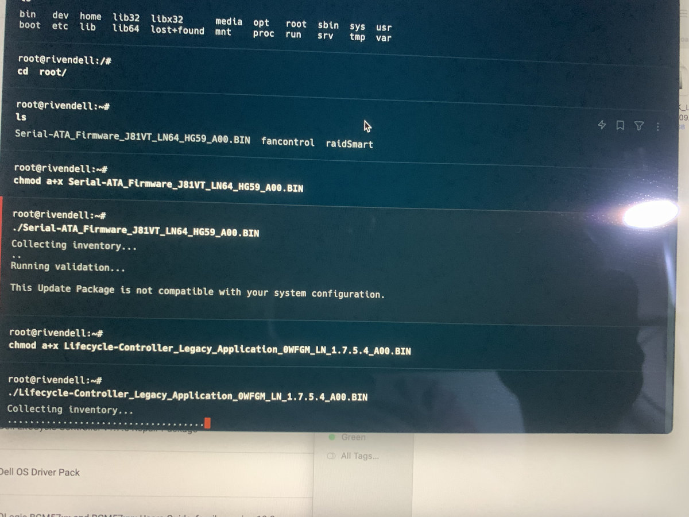

+++
author = "Jonathan Moss"
title = 'Updating a Dell PowerEdge R710'
date = 2023-12-11
description = "This is how to update a Dell R710 Bios and Firmware"
tags = [
    "Software",
    "Home Lab",
]
categories = [
    "Software",
    "Home Lab",
]
series = ["Home Lab"]
image = "splash.jpg"
draft = false
+++

## You have a new secondhand server, what now?

The fist thing you need to do when buying an old server is to make sure you clear, reset any passwords (eg IDrac Password), update the bios and firmware to the latest available version.

## Reset iDrac and change the user passwords

We will first go into the "Remote Access Setup" and reset the iDrac settings and users.
You don't want unwanted access to your server so rather do it from the get go and have the peace of mind that you have secured iDrac with your own user details.

1. Turn on your server and press the "CTRL + E" key on your keyboard when you see a 
```bash 
"Press CTRL + E for Remote Access Setup within 5 sec"
```
message on the screen.

2. Select the ``` "Reset To Default" ``` option

3. Select the ``` LAN User Configuration ``` option a dialog will open for you to change the "Account User Name" and "Password".

4. Select the ``` Network Settings ``` and set a static IP that you will be able to access on your network so that you can use iDrac later. In my case it will be "10.0.0.4"

5. Press the "Esc" button on your keyboard and then chooses the "Save Changes and Exit" option.

You have now successfully cleared the iDrac Settings and created your new user.

## Where to get the firmware and drivers

Dells website has all the files you will need to download and install to get your server up to date. 

https://www.dell.com/support/home/en-au/product-support/product/poweredge-r710/drivers


However having to install each file one by one will be a very tedious process and will be very time consuming.

Dell has a utility called the "System update utility" (SUU) where you can create a bootable ISO image with all the latest firmware on it that you can boot into, it will see what firmware you need and install them.

Due to the R710 being end-of-life it is difficult to find and get an easy to use SSU iso with all the latest updates on it. After a lot of searching I found a wonderful forum where the author (Allen Sampsell) hosts a next cloud instance where you can download a 2019 version that has most of the up to date drivers and firmware.

https://forum.allenscloud.com/t/dell-r710-firmware/14


## Creating a bootable USB from the ISO

I was only able to create a bootable USB when using "Rufus" https://rufus.ie/ other software such as Etcher was not working as it was not creating the boot partition correctly. Rufus was as simple as selecting the ISO, choosing my USB and clicking the "Start" button.


### Booting from the USB

1. Insert your usb into your server, I have my keyboard and mouse plugged into the front USB ports and have plugged the USB into the back USB port.


2. Turn on your server and keep pressing the "F11" key on your keyboard when you see the Dell logo appear. This will eventually open the "UEFI Boot Menu". This will also work in legacy / Bios boot mode.


3. Choose your USB device and your server should boot up using that.


4. Once it has booted, it will automatically start the update process. Please note that depending on how many updates it needs to do, this can take a very long time (30 minutes +)


## Installing any new firmware updates from a linux host OS.

A few weeks later I noticed that the "Lifecycle Controller" on my server was not updated to the latest available version. So the quickest way for me to install it was to download the file frow Dell's support page and install it through the host OS that I have installed.

1. Since I have Proxmox installed as the main host OS, I downloaded the ".BIN" file. In this case it was the "Lifecycle-Controller_Legacy_Application_0WFGM_LN_1.7.5.4_A00.BIN" file.


2. Using your favourite terminal software, use the "SCP" command to upload the ".BIN" file to proxmox. (10.0.0.2 is the IP address of my server)
```bash
scp /Users/jono/Downloads/Lifecycle-Controller_Legacy_Application_0WFGM_LN_1.7.5.4_A00.BIN root@10.0.0.2:/root
```
This will copy the file to the ```root``` folder on proxmox.


3. Next, ssh into the proxmox server
```bash
ssh root@10.0.0.2
```

4. We then need to set the file as executable with the following command:
```bash
chmod a+x Lifecycle-Controller_Legacy_Application_0WFGM_LN_1.7.5.4_A00.BIN
```

5. Now run it with:
```bash
./Lifecycle-Controller_Legacy_Application_0WFGM_LN_1.7.5.4_A00.BIN
```


6. Press "Y". It will install the update if it is compatible with your server, if not it will let you know. This can take a very long time (10 minutes +)


## Conclusion

If everything went smoothly, you will have an up to date sever, well at least to the latest updates that is available for your server. Since the Dell R710 is end of life, you will not get many new updates.
I tried to install a few of the new "SAS and Storage" firmware and drivers updates they have available. However I would always get a "This Update Package is not compatible with your system configuration" message. I was in particular, trying to install the new "Samsung" SSD firmware updates to try get my "Samsung 870" to hopefully be seen as a compatible device, but was unsuccessful.

Please note that the "Samsung 870" works perfectly so far, I just get a "compatibility error" all the time on the LCD screen and on iDrac which can be very annoying for me.  